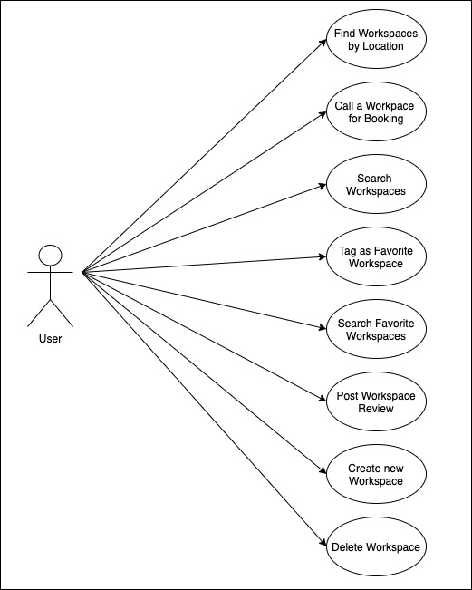
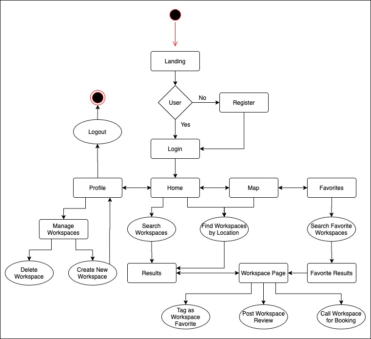
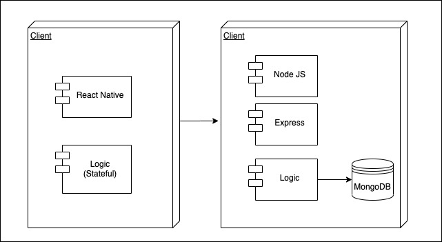
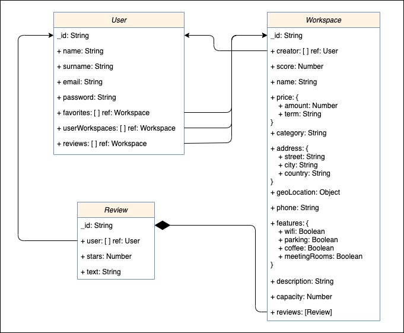
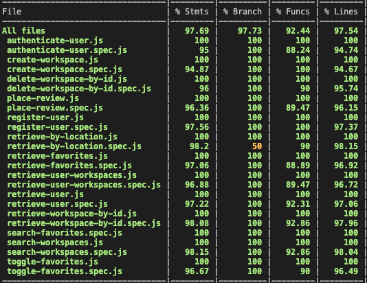
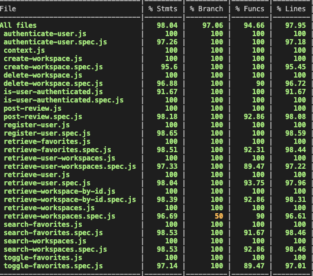

# Nomad App

## Introduction

The world is changing, the current situation has made us take new perspectives on how we conceive the way to exercise our professions. Working remotely has come to our reality to stay, and that implies the possibility of working with **geographic freedom**. Long ago the freelance people who began to combine their work with traveling and exploring the world, began to call themselves *digital nomads* and now becoming one of them is more possible than ever. **This is why *Nomad* was born.**

**_Nomad_** was made with the purpose of making easier working for nomads and freelancers. By finding spaces to work with people, share moments and experiences, free workers will be able to choose the best place for their work and inspiration. Wherever you go, you are just a click away from finding the perfect place to work today. 

*Choose your next work environment, create your day with Nomad.*

## Functional Description

- User must be registered for using Nomad.

- Once registered users will be able to find workspaces by location, search workspaces, explore the world with the map page, see the details of a workspace, manage a list of favorite workspaces, and create new workspaces.

- Users will be able to search by query (by name, city or country), also filter workspaces by their categories (cowork, coffee, library, shared space).

- With the map view, users will see at a glance nearest workspaces near them sorted by distance. If the user wants to explore other places worldwide, just with a drag & drop to the place desired workspaces will refresh to get  that position nearest workspaces.

- With the details page of the workspace, user will be able to see all details concerning to that workspace. Will be able to tag that specific workspace as a favorite, place a review, and call to the workspace to get more info or book a place.

- Users can manage a list of favorites, by using favorites list, they will have a shortcut to all tagged workspaces and find by query on that list (name, city, country).

- On profile, the user will be able to create a new workspace listing, delete one previously created, and logout.

### Use Cases

### Flow

## Technical Description

### Blocks

### Data Model

### Server Code Coverage

### Client Code Coverage

### Trello

[Nomad Trello Link](https://trello.com/b/eoJnQ7hQ/nomad)
