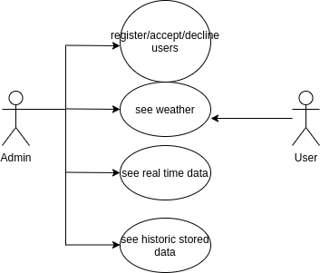
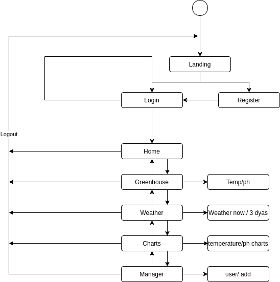
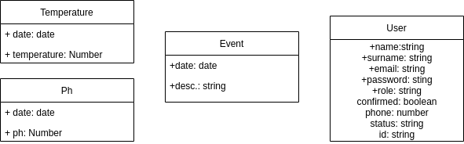
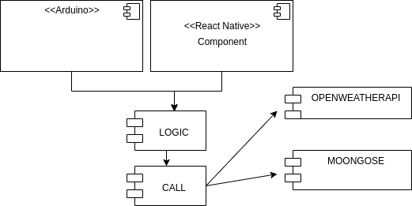
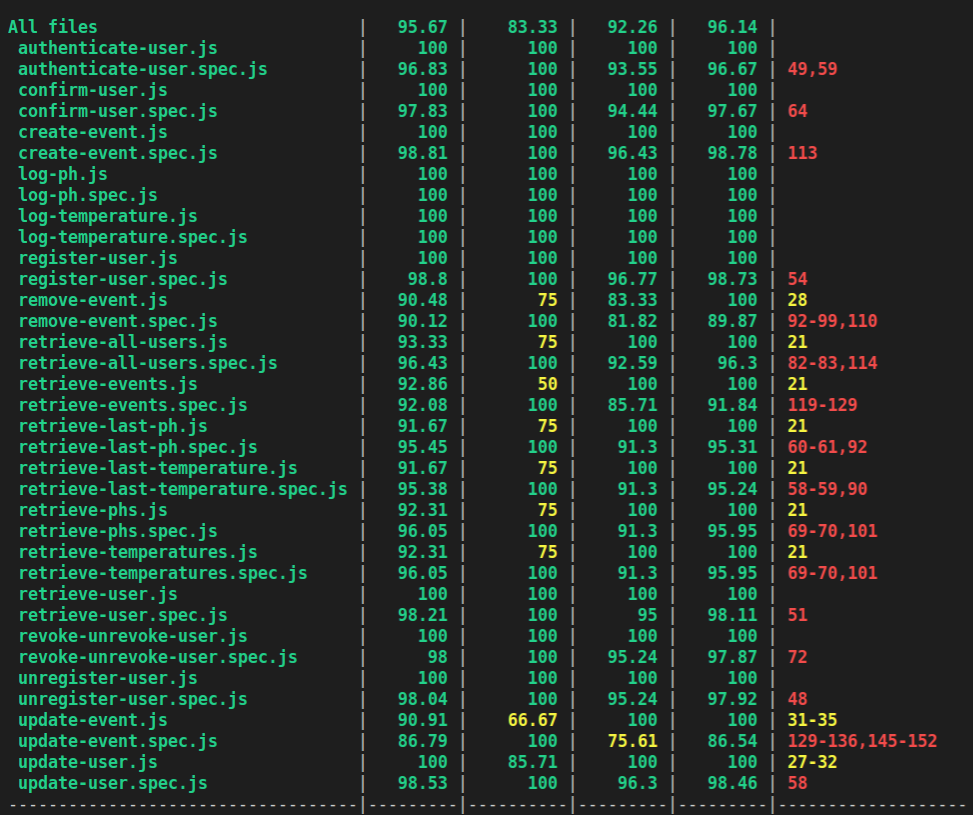
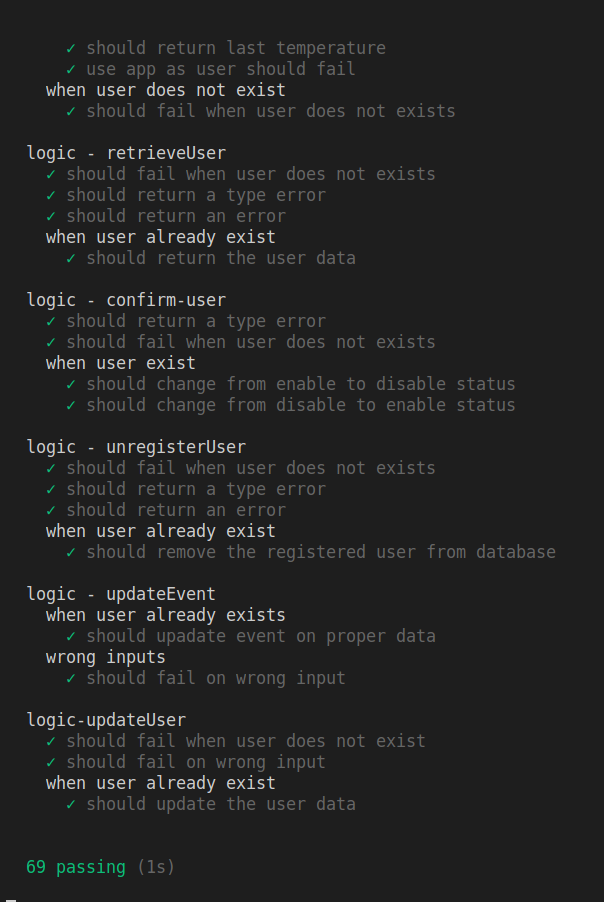

# Aquaponics

## Introduccion
This project is about monitoring a closed area by means of robotic sensors, in order to translate the data in to App warnings/notification. 

Firts of first would like to let you know to get you in context, all this idea was oriented to a personal business i have and based on personal expirience, still..., i wanted to face it as a small scale business so i could open it more to everyone.

## Functional Description
we will have features such as:

-   Register a user , still this will have to be validated by a admin.
-   Authentication of the user.
-   Check out the weather using an openWeather API .
-   Monotoring stats live time thrgough wifi using arduinos.
-   Log data in order to make charts.

Hope you enjoy it! 

## Use cases

## Flow 

## Blocks

s
## Data model

## Components

## Testing 

