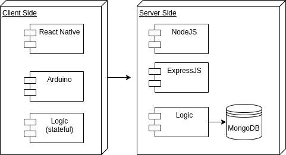
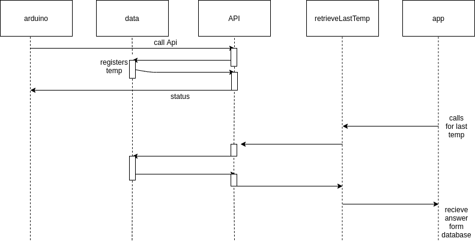
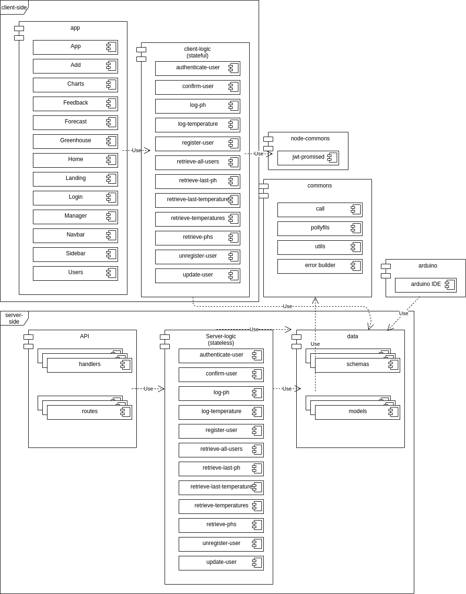
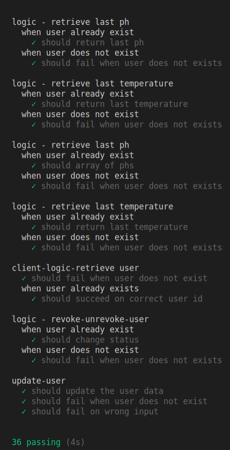
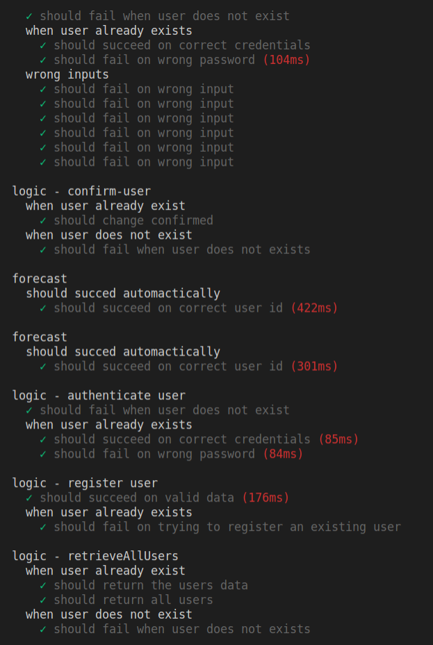

# Aquaponics

## Introduccion
This project is about monitoring a closed area by means of robotic sensors, in order to translate the data to an App with warnings,notifications and monitoring. You will be be able to manage and administrate users, also to check check the weather and monitor stats live whererever you are.

## Functional Description

we will have features such as:

-   Register a user , still this will have to be validated by a admin.
-   Manage users registered.
-   Authentication of the user.
-   Check out the weather using an openWeather API .
-   Monotoring stats live time thrgough wifi using arduinos.
-   Log data in order to make charts.

Hope you enjoy it! 

### Use cases

### Flow 

## Technical Description

### Blocks

### Data model

### Components

### Modules/Components

### Modules/Components

### Testing 

