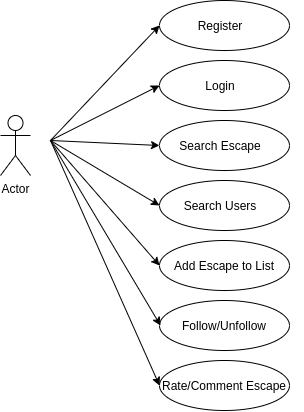
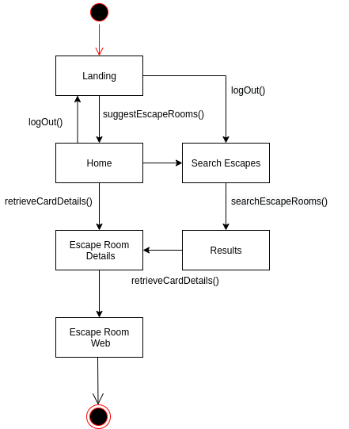
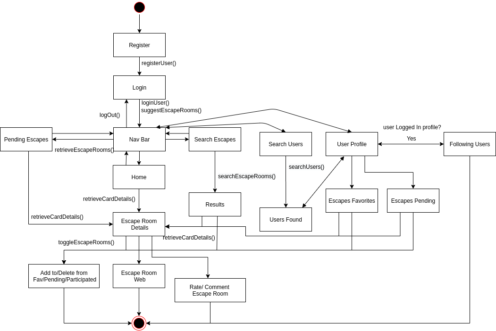
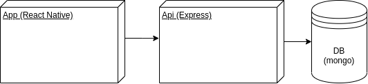
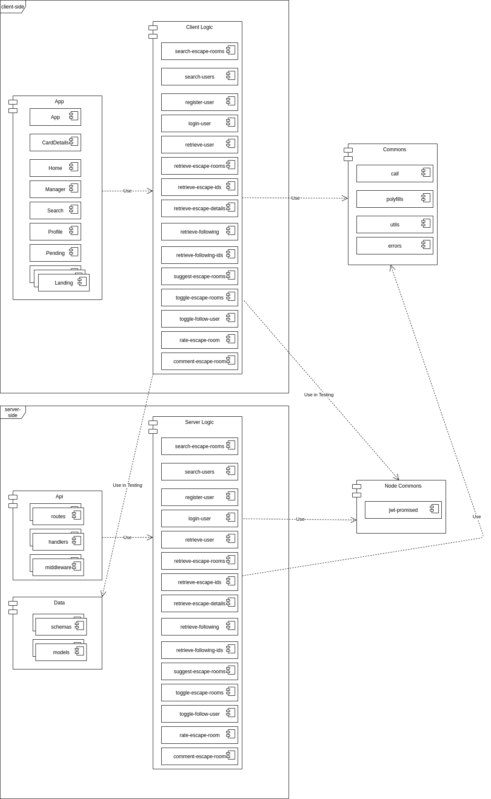
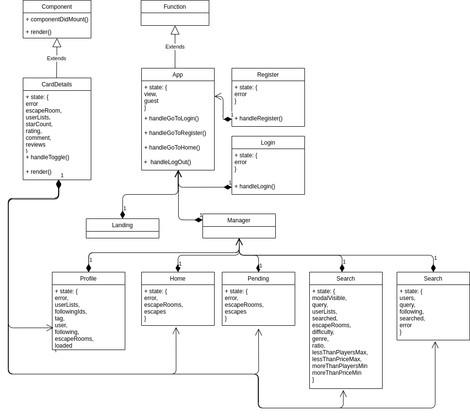
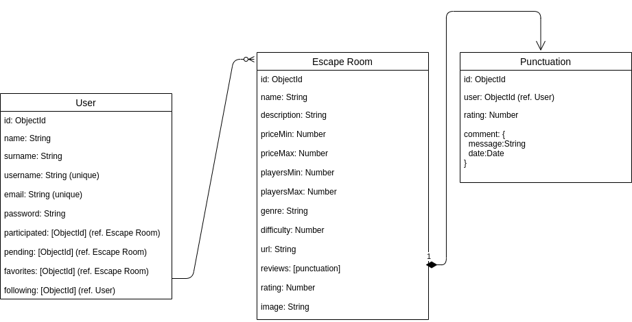
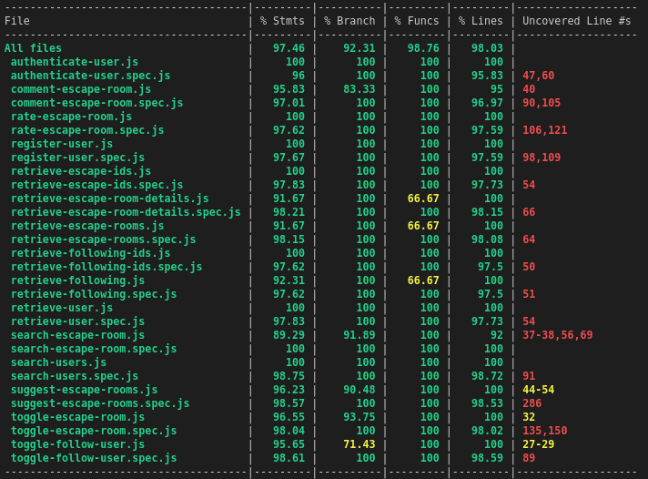
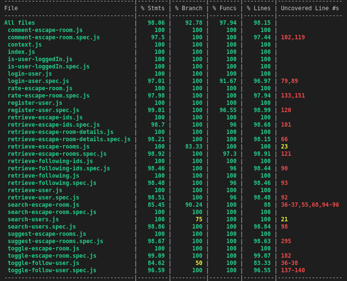

# Escape Me

Escape Me is a react native app that allows people to discover new escape rooms and share their experiences, also this app will be useful for people who wants rate and comment about specific escape rooms. Also users can add roomscapes in a TO DO list, a FAVORITES list or in DONE list. With this app you can follow other people to know which roomscapes have they made and which escape rooms are their favorites.

## Functional description

* User registering, login and a guest mode.
* Home Page that suggests potential favorites escape rooms to the user taking care user's profile, if user is a guest, random escape rooms will be suggested.
* Rate and comment escape rooms letting other people know your experiences.
* Searching escape rooms using a query method and an optional filter settings to make more accurate searches.
* Add escape rooms to a list of pending, favorites and/or participated.
* Search users and see their profiles to visualize their favorites and partcipated escape rooms.
* Follow/unfollow users.
* Visualize user's list of pending escape rooms.
* Visualize user logged in profile, this allows to visualize his favorite escape rooms, done escape rooms and users being followed.

## Use Cases Diagram

## Guest Flow Chart

## Flow Chart

## Blocks Diagram

## Components Diagram

## Classes Diagram

## Data Model

## Server Side Test Coverage

## Client Side Test Coverage

