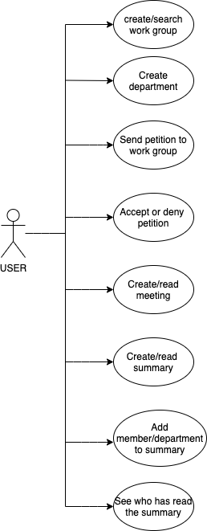
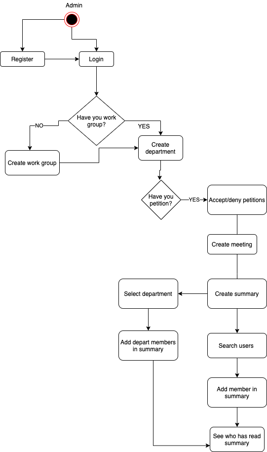
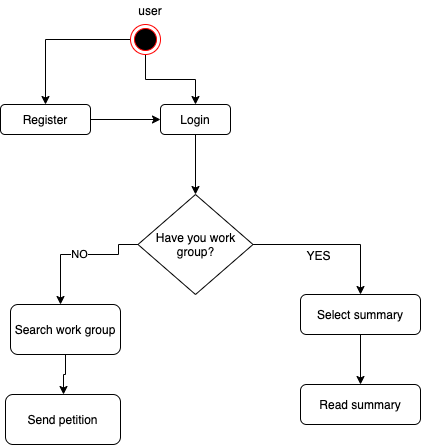
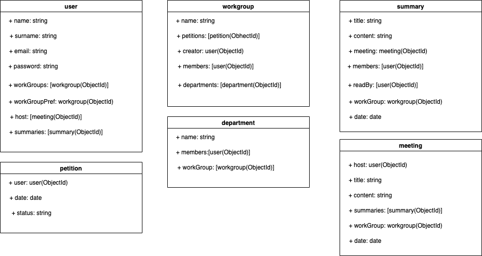
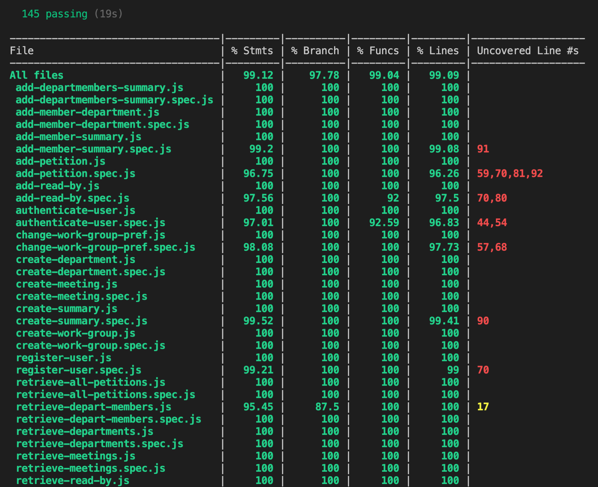
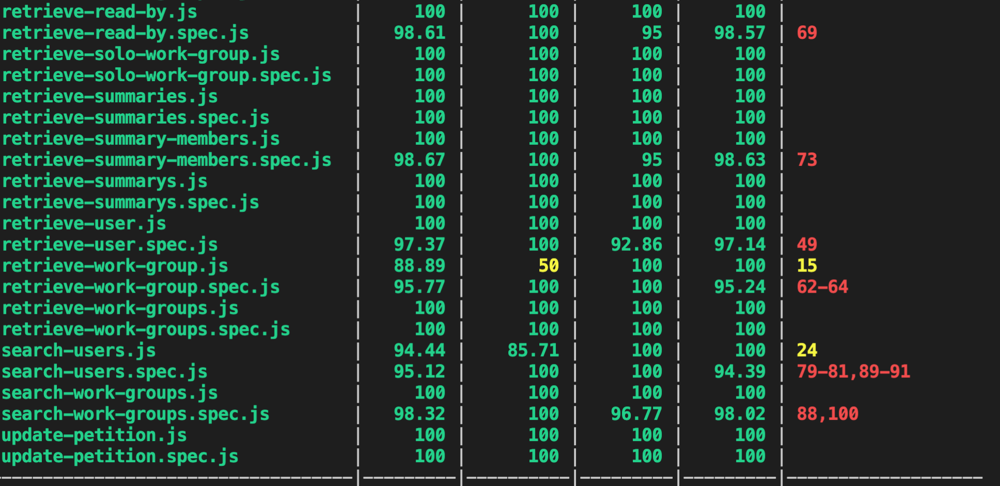
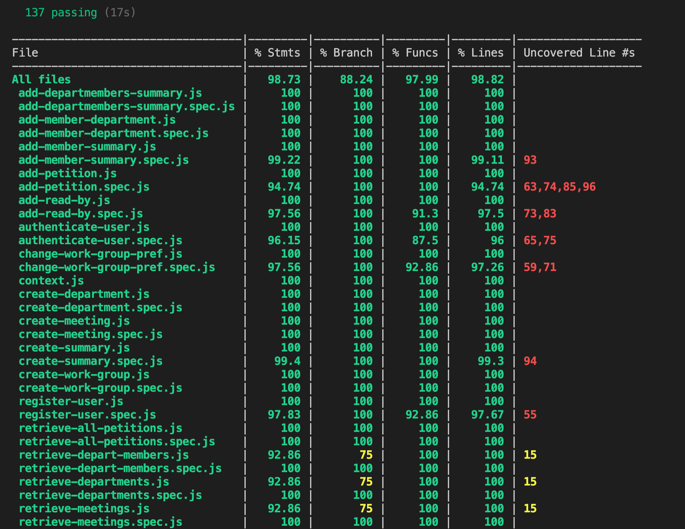
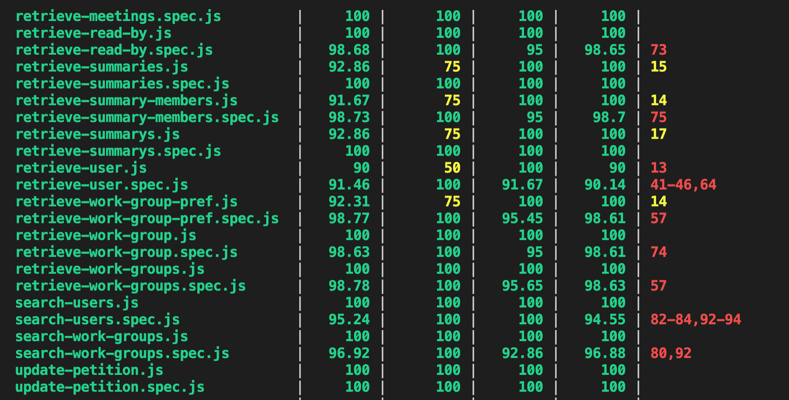

 # Work-meeting

Work-meeting is an application that stores meetings and manages their reading and distribution.
If you have a company and you lack organization, this is your app!

## FUNCTIONAL DESCRIPTION

* Register user
* Login user
* Create work groups
* Create departments
* Search work groups
* Send petition to a work-group
* Accept or deny petition
* Create meetings
* Create summaries
* Add member to summary
* Add department to summary
* Read to summary
* See who has read the summary

 

 ## USE CASES

 

 ## Activities
 ### Admin
 

 ### User
 

 ## Block Diagram

 

 ## Data Model

 

 ## Code Coverage

 ### server side

 
 

 ### client side

 
 

