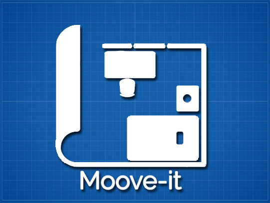
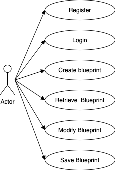
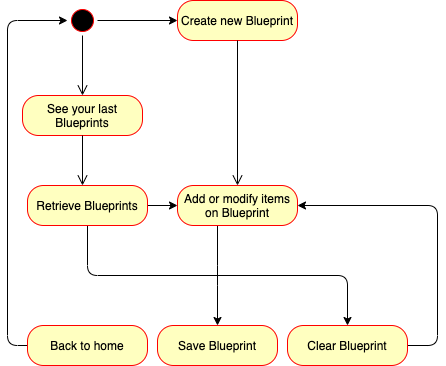
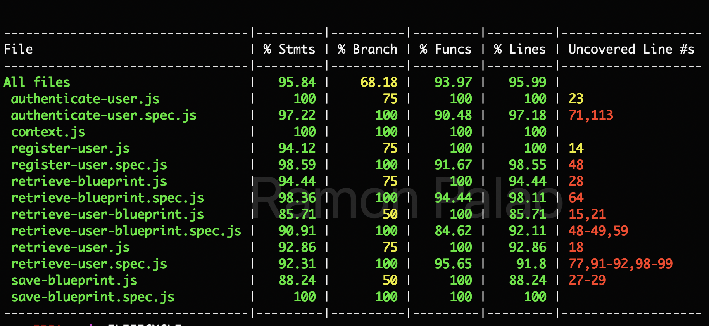
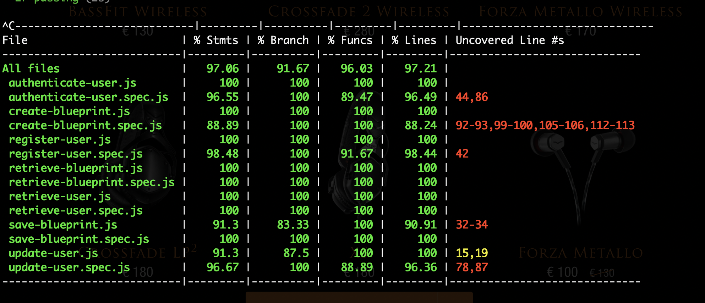

# Moove-it v.1.0.0

## Description

Moove-it, is the final solution to plan how to re-distribute any space at home, such as room, living room, bathroom, etc. The most important target of this app, is to redisgn all this distribution without move anything until the user be sure all the things could fix and looks as they expect, and once the user decided if its ok with the distribution can get a plane of that and make it just as planned.

This app were inspirated on my personal neccesity to sometimes change my room, but without know if my furniture could fix or the organization will be fine for movility, so then, have to look for alternatives or even pay for some apps to make it, but even paying sometimes was not enough.

## Functional description

* User regististration and login
* Indicate the dimentions of space, horizontal and vertical
* Add furniture with size in cm horizontal and vertical
* Drag every element and drop in the part do you need
* Modify any element if is neccesary
* Save the distribution on user profile
* Search desgins from other user based on kind of spaces like, room, living room, etc.
* User update interface

### Use cases

### Data Model

### Activities

### Blocks

### Module/components

### Code Coverage

##### Client Side

##### Server Side
