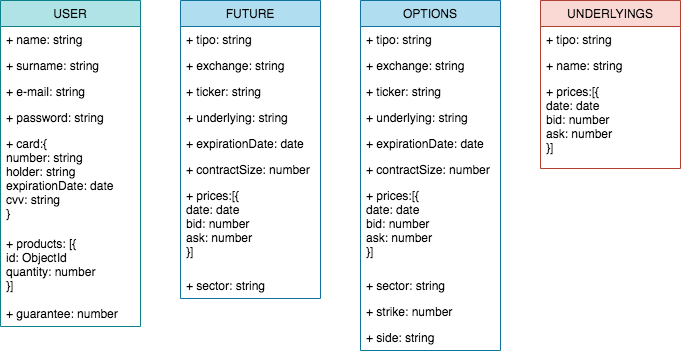

# GrowYourMoney

## Description
This small app allows you to oparte with exchange-traded derivatives like future and optopns whose underlying is an index or equity.
The following exchanges will be available:
- MEFF
- EUREX
- CME

The client must inform your account from which an initial guarantee will transfer (10% of the nomial of the first operation).

In case of futures, the settlement of losses and gains will be made daily based on the evolution of the price of future. The settlement will be made automatically. The position will be closed automatically in the expiration date if the client does not want to extend the expiration date (roll over).

The app will notify the client about upcoming expirations and coonsecutive losses if produced.

## Data Model

