# GrowYourMoney

## Description
This small app allows you to oparte with exchange-traded derivatives like future and options whose underlying is an index or equity.
The following exchanges will be available:
- MEFF
- EUREX

The client must inform your account from which an initial guarantee will transfer (10% of the nomial).

In case of futures, the settlement of profit and losses will be made daily based on the evolution of the price of future. The settlement will be made automatically. The position will be closed automatically in the expiration date. The user can close her position carrying out the trade in the opposite direction and same price to the original trade.

The user can check your contracts and trades, asset allocation by sector, exchange and type of product.

The user can check your current and historic account balance.

## Functional Description

### Use Cases

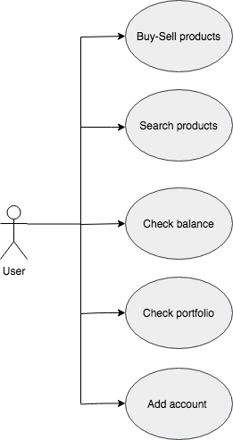

### Activities

List products

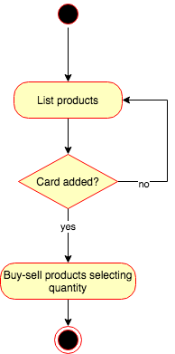

Show product details

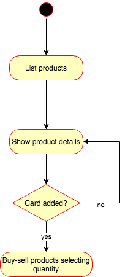

Search products

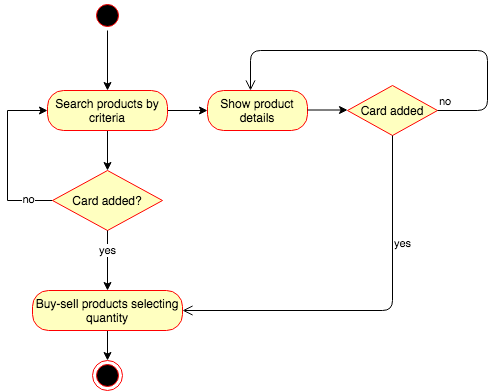

Add user card

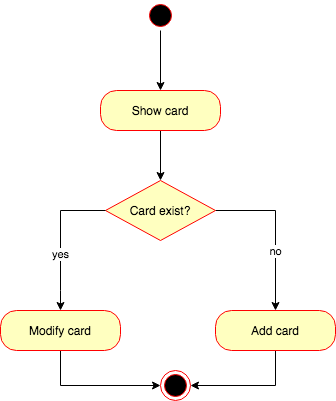

## Technical description

### Blocks

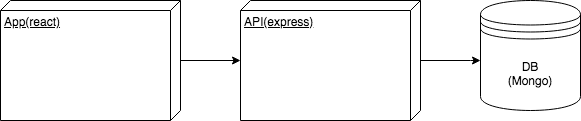

### Modules/Components

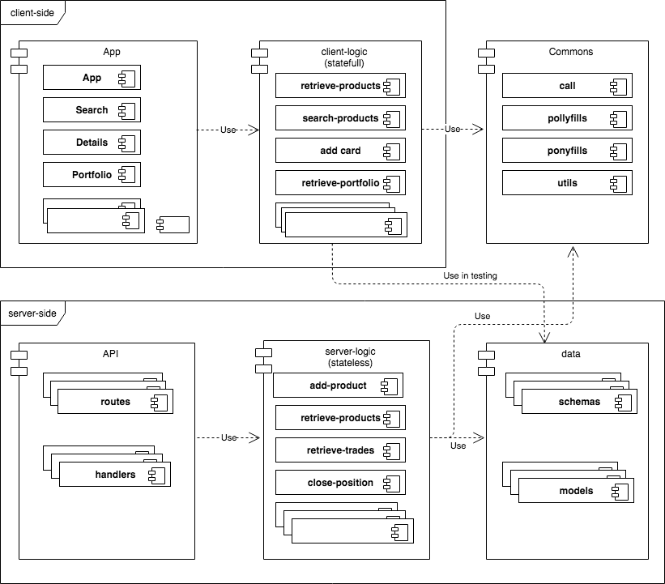

### Classes

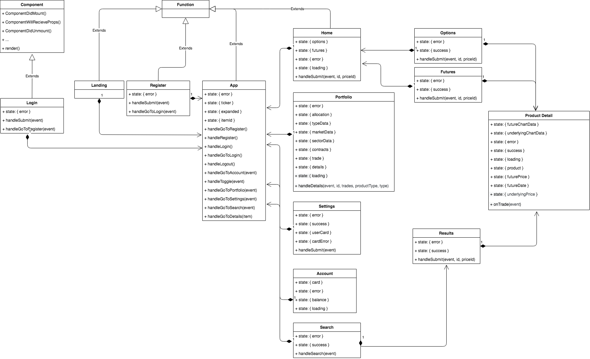

## Data Model

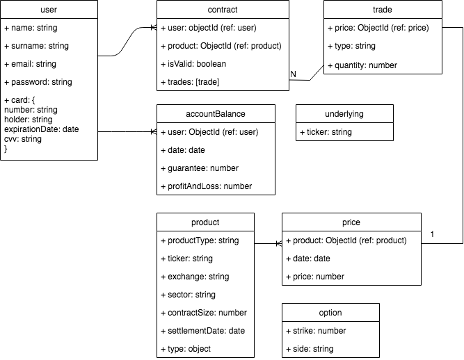

### Test Coverage

Client-side

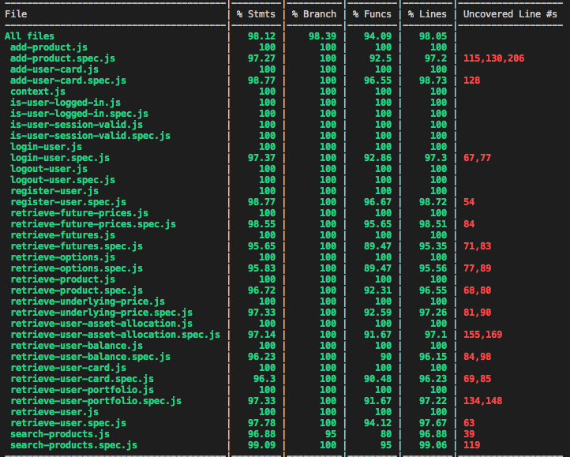

Server-side

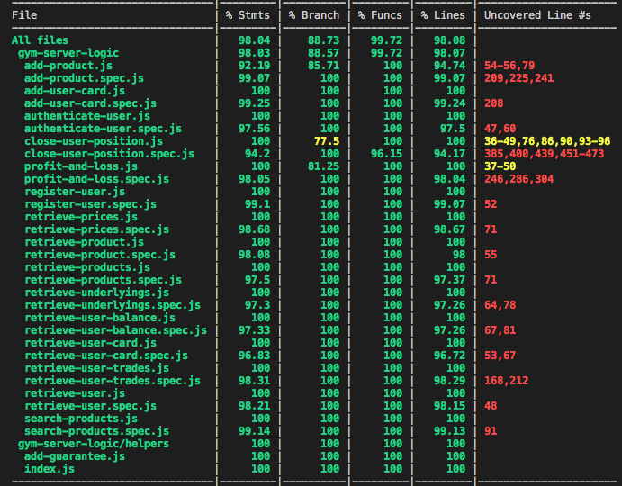

