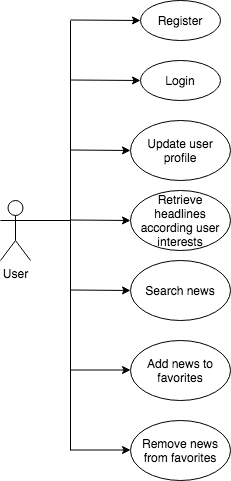
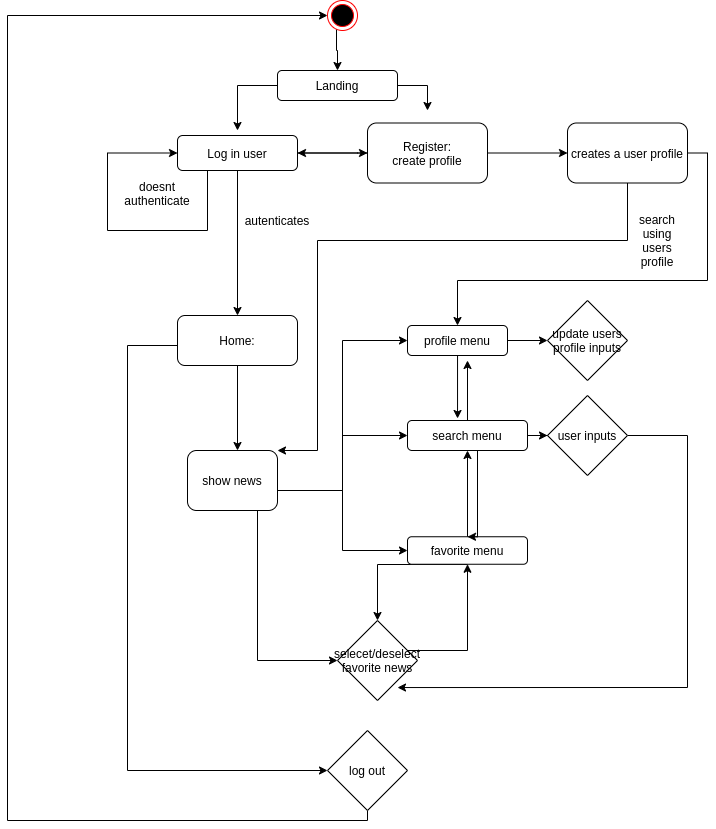
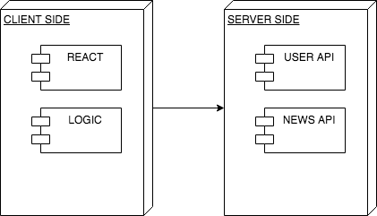
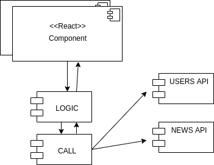
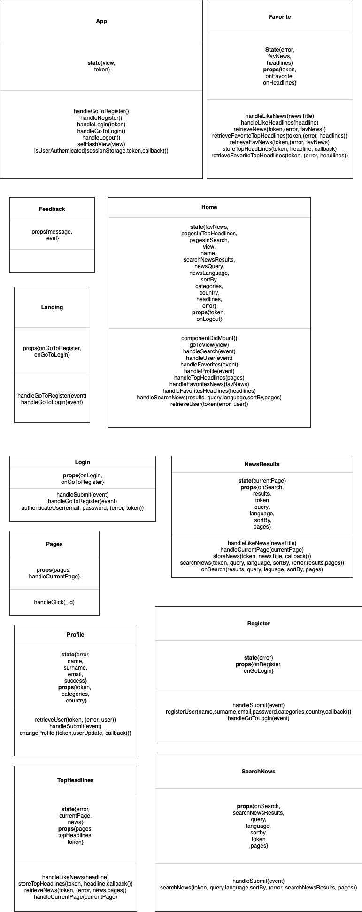
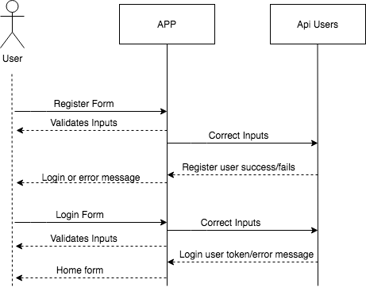
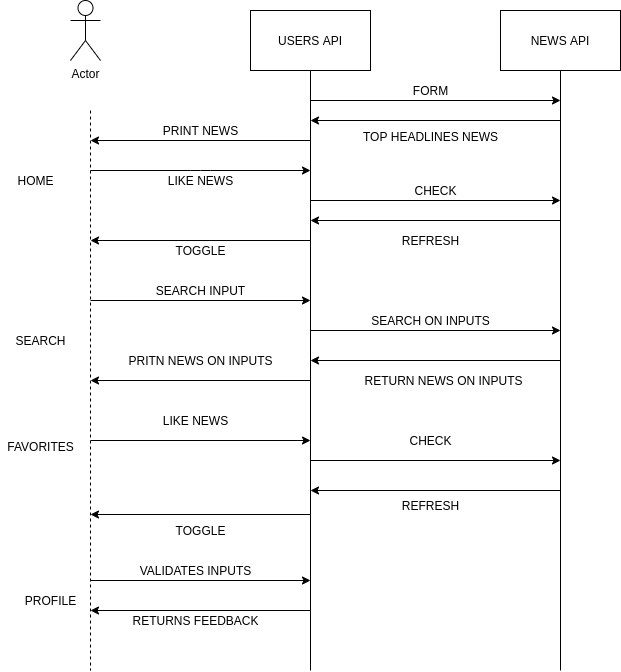
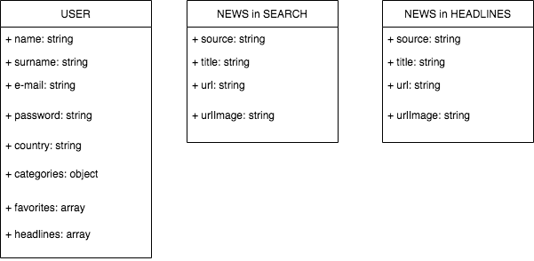
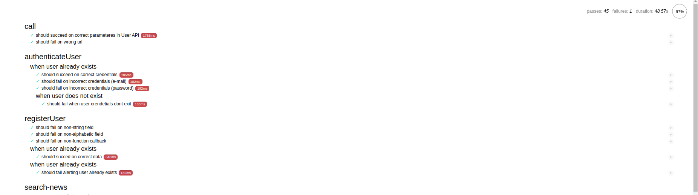
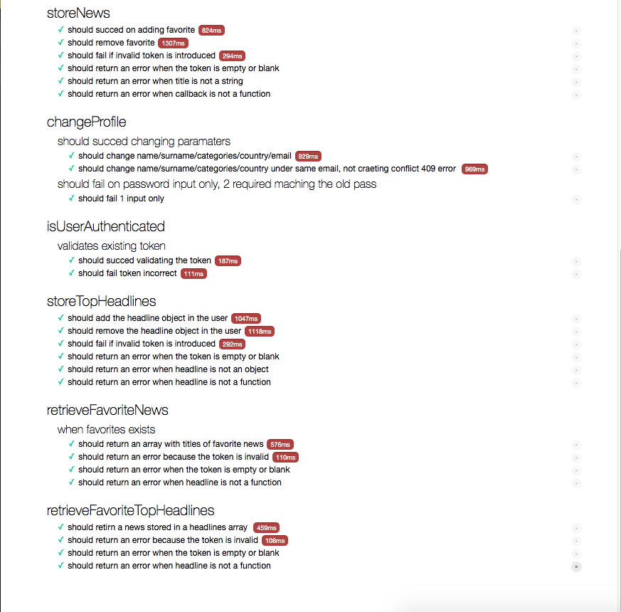

# Clear news

## Description

This app is designed the survey news world-wide. You will be able to search and follow news using different end points of the API used, as well register and authenticate the user profile.

## Features

    - Search news
    - Register user
    - Update user
    - Follow news

### API

[news API](https://newsapi.org/docs) 

[users API](https://skylabcoders.herokuapp.com/api/v2/users)

### Use cases

### Activity Diagram

## Technical Description

### Blocks

### Components

### Classes (functions)

### Sequences

 

### Data model

### Tests

 

