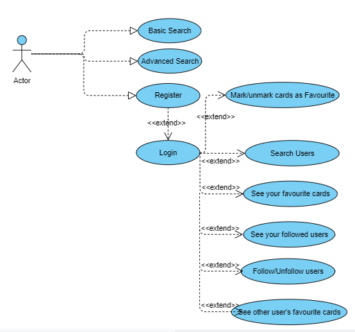
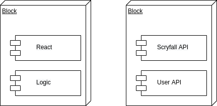
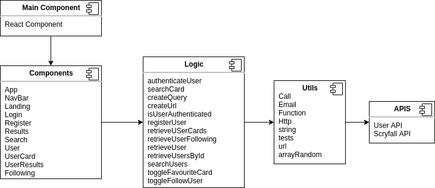
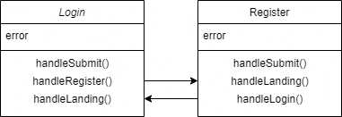
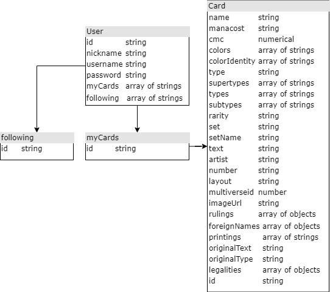
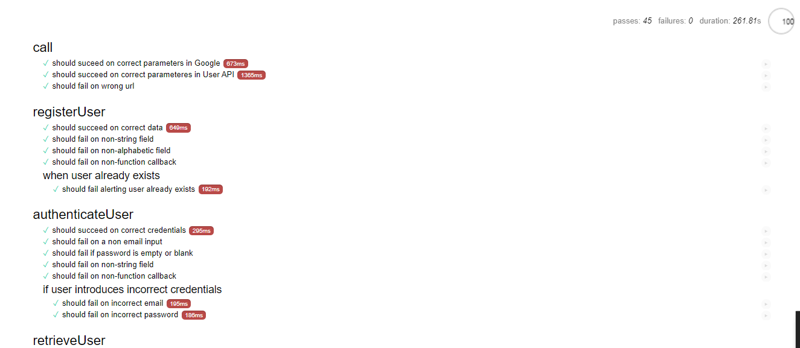
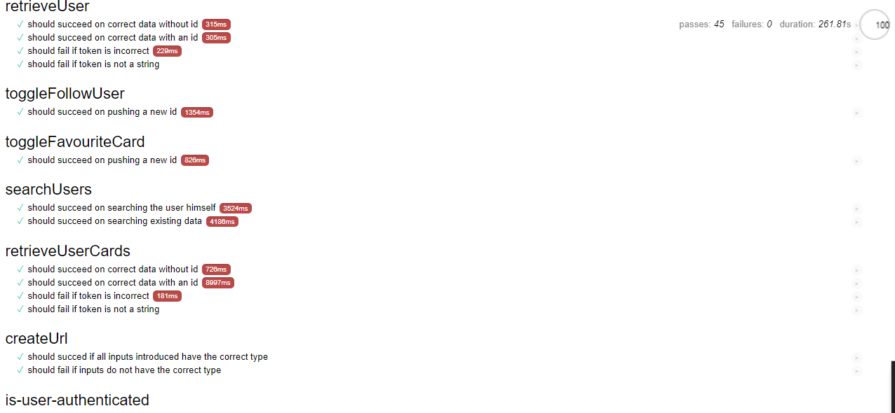
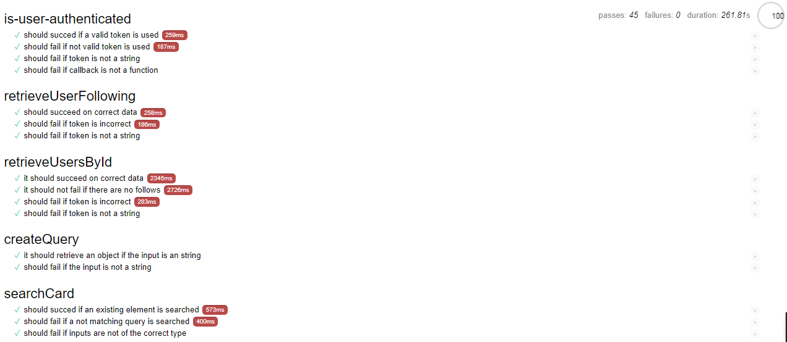

# CardSearch

## Introduction

This app provides a detailed Magic: The Gathering card search engine as well as social features: marking cards as favourites, following other users and seeing ther favourite cards.

## Functional description

### API

[news API](https://scryfall.com/docs/api) 

[users API](https://skylabcoders.herokuapp.com/api/v2/users)

### Use cases

### Activity Diagram

## Technical description

### Blocks

### Components

### Classes

### Data Model

### QA

