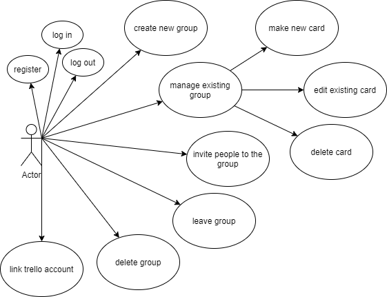
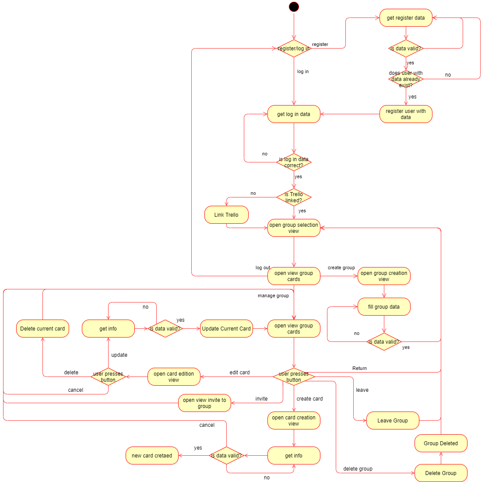
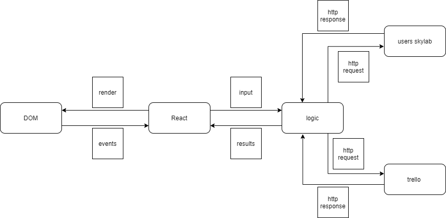

# Task Talk

## Functional Description

This App is a notepad that helps you and other people to organize better by making an online platform where you can create and share tasks like the home chores or the shopping list.

### Use Cases

### Activities (flows)

## Technical Description

### Blocks

### QA (testing)

