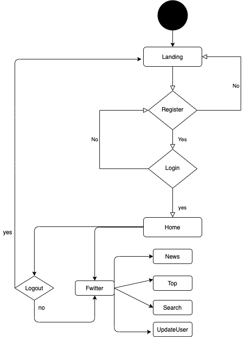
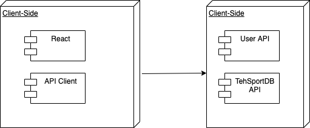
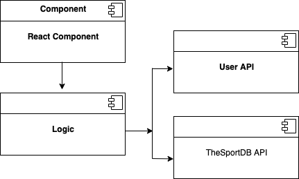
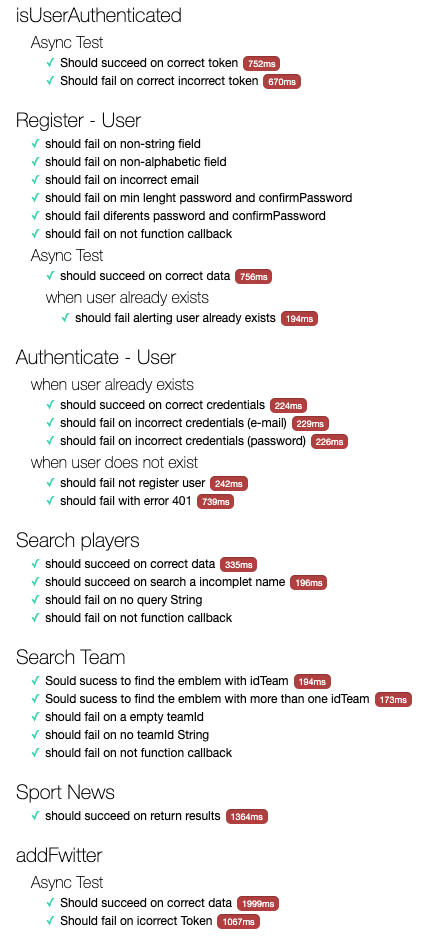
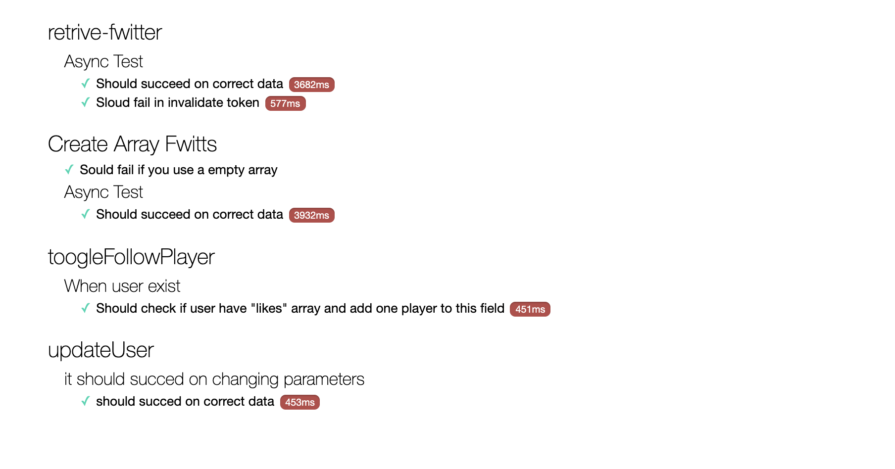

# Footify

## Introduction:

The best soocer app to keep you player up to date. User can send fwitt message to the player with the famous fwitter direct message system, also you can searach any player by name trough [The Sports DB](https://www.thesportsdb.com/api.php), comment on the result itself if you want, also, you can push like to thos player to give the change to this player to be on the top 11. Another funcionality is to go to see the fwitts and then press the link of the player and the app will redirect to the player card to make a new comment, like or dislike this player.

The application is developed with [React] (https://reactjs.org). The design has been made with SASS.

## Functional Descrition

### Use Cases

### Activities (flows)

## Technical Description

### Blocks

### Components

### QA (testing)

