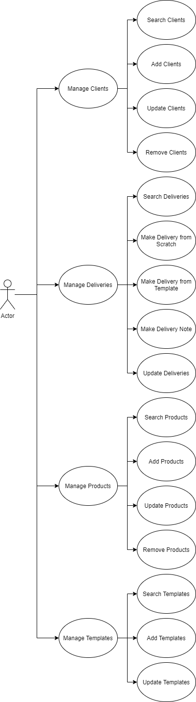
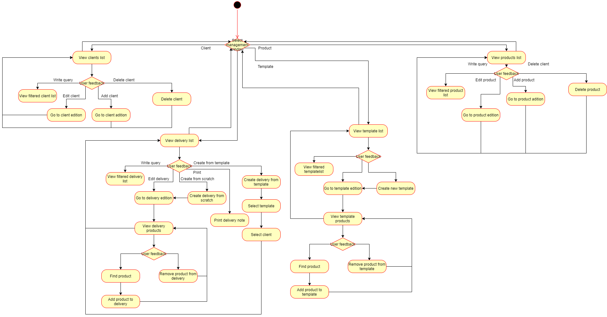
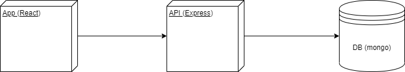
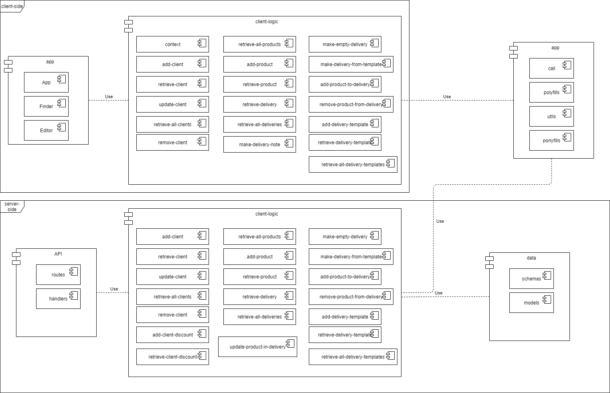
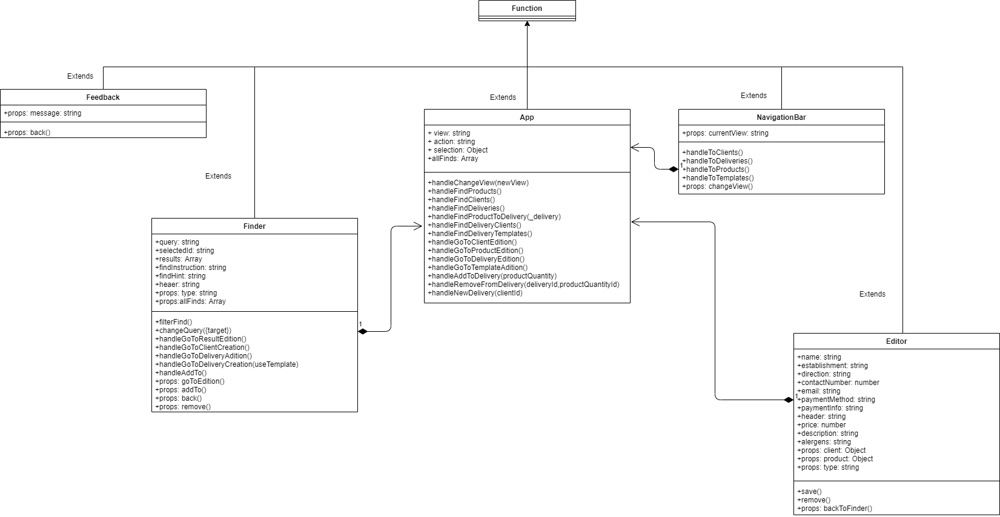
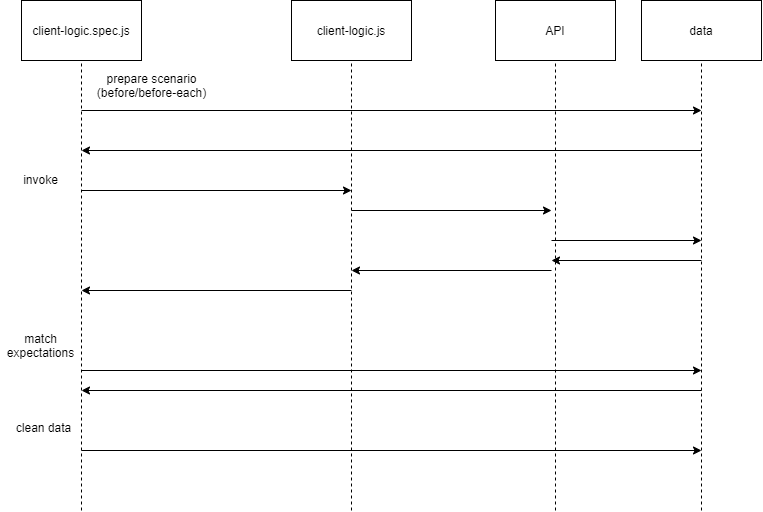
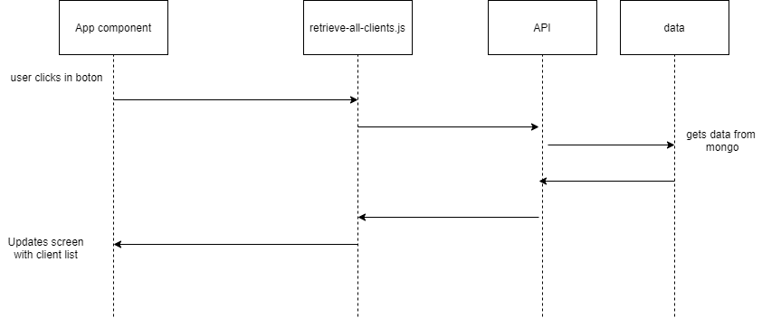
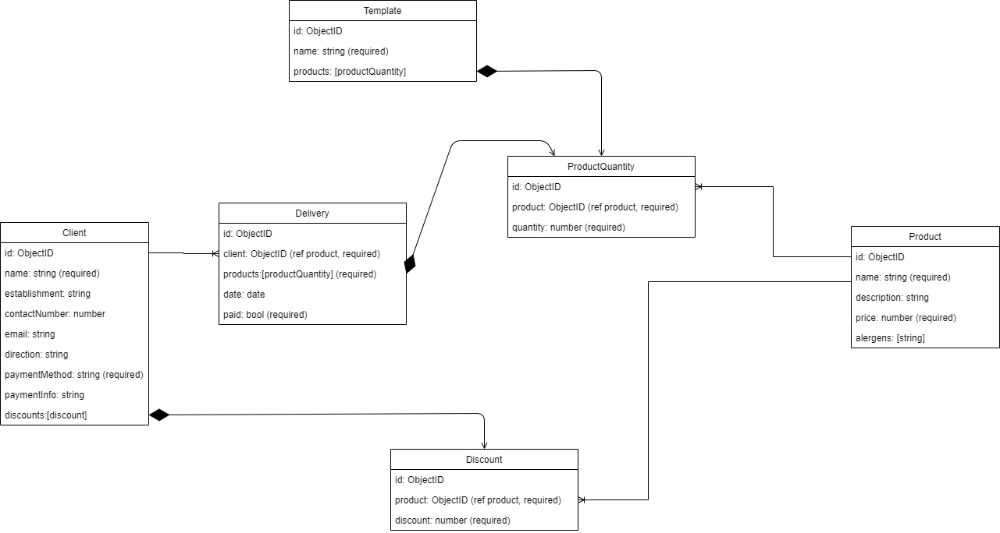

# Facturator

## Description

Full-stack app developed to help the management of a business.

### Features  
    - Create delivery notes
    - Save new clients and client's info
    - Keep track of past sells
    - Manage your products

### API and libraries

[Facturator API]()

[PDFMAKE](https://pdfmake.github.io/docs/)

### Use cases

### Activity diagram

## Technical description

### Blocks

### Components

### Classes (funcitons)

### Sequences

### Data model

### Test

## Misc

### Trello

[Facturator Trello](https://trello.com/b/dlcCNVS6/facturator)

### Github

[Facturator github]()