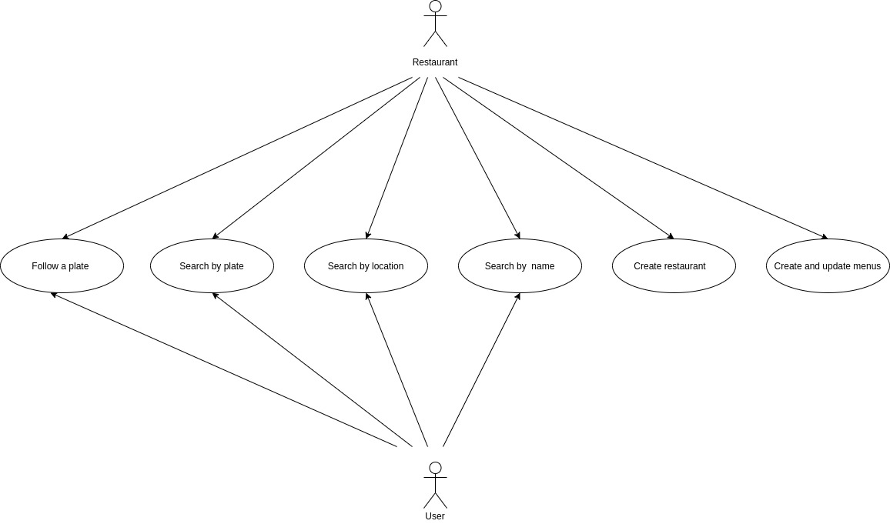
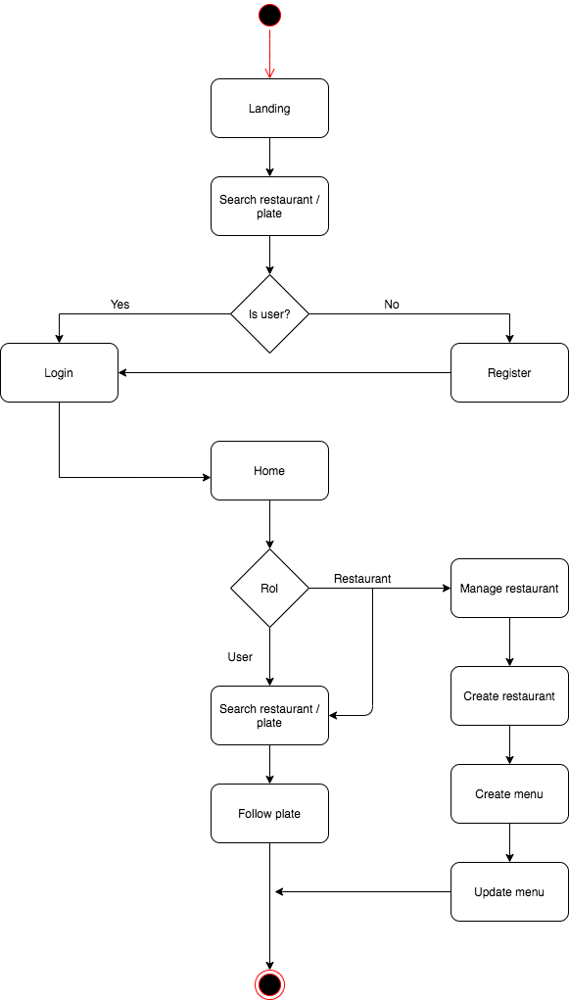

# PLATES, an easy way to find your favourite plates....

## Introduction 
 
 With Plates you'll be able to find restaurants in any location you want to search or by name  and will allows you to see all plates from their menus. With features like search a restaurant for a single plate or recibe a notification if a restaurant runs out of a choosen plate.

 

## Functional description

    -Login
    -User register
    -Restaurant register
    -Search restaurants by location, name or plate.
    -Menu's management
    -Follow a plate in a restaurant

## Use cases

## Activity diagram
