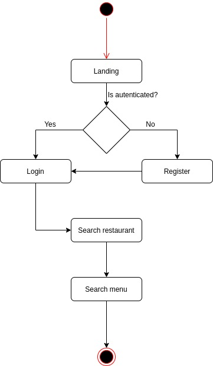

# PLATES, an easy way to find your favourite dishes....

## Introduction 
 
 Dishes is a restaruant searcher that allows get restaruant's information as addres, contact...etc, and see all dishes in the menu.

 

## Functional description

    -Login
    -User register
    -Search restaurants
    -Retrieve restaurant's information 
    -Retrieve restaurant's dishes in menu

## Use cases

## Activity diagram

## Blocks

## Modules / Components

## Data model

## Code Coverage

Server site

Server site

 
