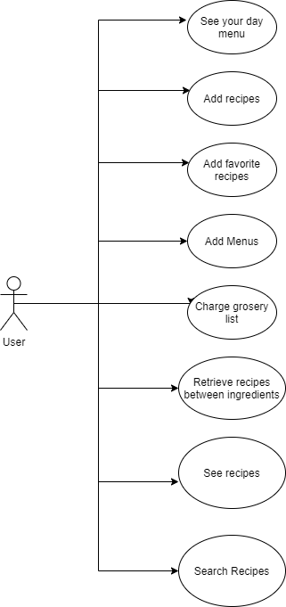
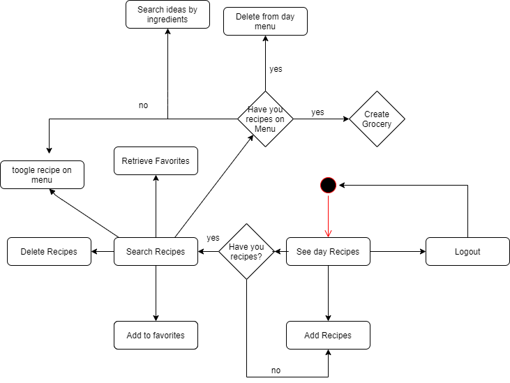
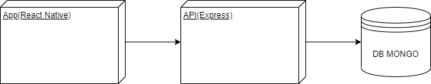
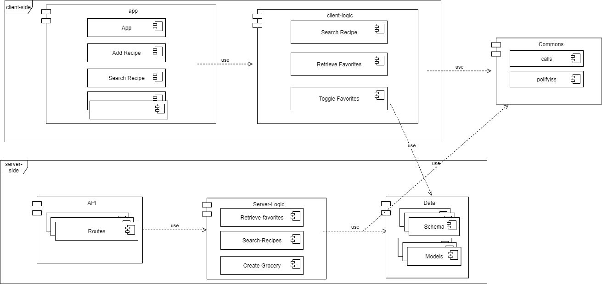
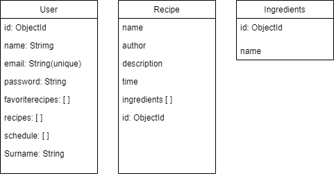
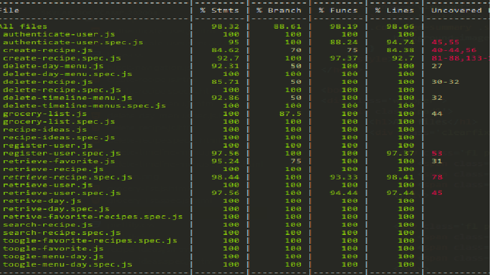
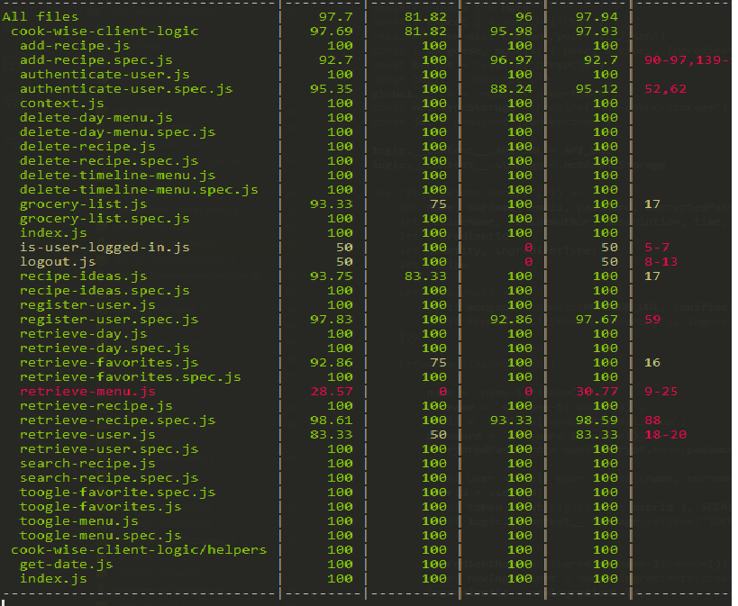

 # COOK WISE

 Cook Wise is an application for the home cooking organization, this app is an idea that borns because my own vision and needs, we want to help you to make sense on your grocery list and dont throw the food that you buyed. In the app you can create and store your recipes, organized by favorites on put in the schedule of the week. If you don't have ideas you can search ideas for your own recipes for organize your week meals.Organize your meals! organize your life!, 

## FUNCTIONAL DESCRIPTION

* Register/Login user
* See Dayly recipes
* Add recipes
* Search recipes 
* Toggle recipes to favorites
* See favorite recipes
* Toggle recipes to menu
* Delete recipes
* Search recipes by ingredients
* Make the grocery list

  

 ## USE CASES

 

 ## Activities

 

 ## Block Diagram

 

 ## Modules / Components

 

 ## Data Model

 

 ## Code Coverage

 ### server side

 

 ### client side

 

 