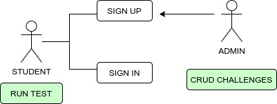
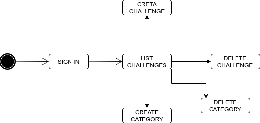
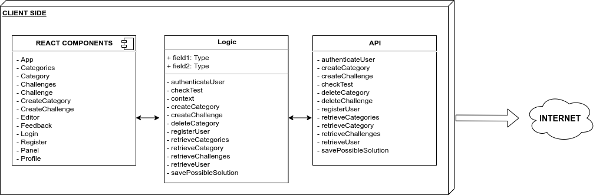
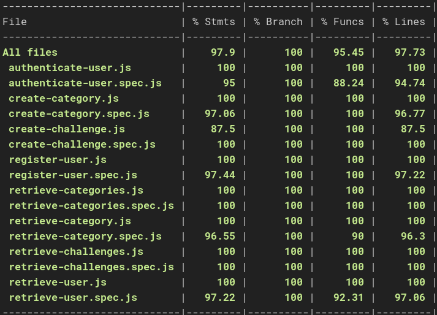

# CODE THIS

## Introduction

Code This is a web application made for students who need to practice the basics of Javascript. It can also be useful for teachers interested in creating their custom javascript exercises for their students.

Code This app uses Mocha to run the tests created by the admin, and it checks whether the student's solution is correct or not.

### Use cases

### Flow Student

### Flow Admin

## Technical Description

### Blocks - Client Side

### Blocks - Server Side

## Data Model

## COVERAGE

