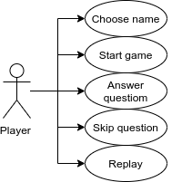

# Pasapalabra

Pasapalabra game provides for each letter, a question or definition of a word starting with or containing that letter. The player can answer with a word, or pass by typing "pasapalabra" (or pushing the button "Pasapalabra"). The goal is completing the 'rosco' with as many correct answers as possible and very few wrong answers.

## Functional description

This pasapalabra game is done working with module pattern which is used to wrap the variables and functions together in a single scope. And only return an object of public methos or variables.

### Example of module pattern:

- Public methods:
    - Init: 
        - Fill the array randomly with questions
        - Draw the 'rosco'
        - Start the game
    - Next:
        - Answer validations
        - Checks if game is over
        - Clear timer interval
    - Replay
        - Reset initial values

