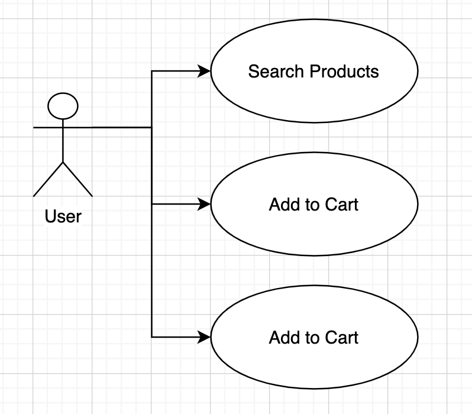
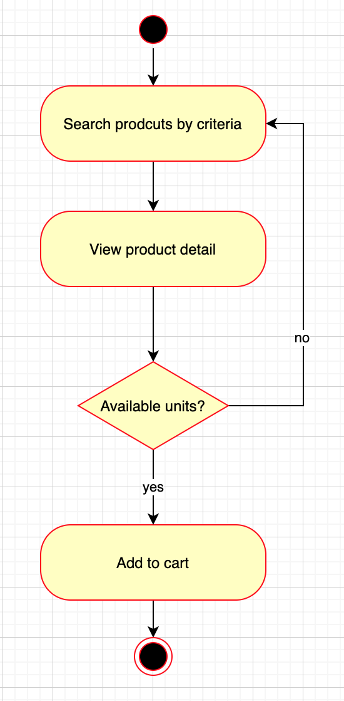
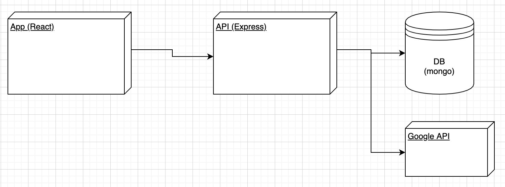
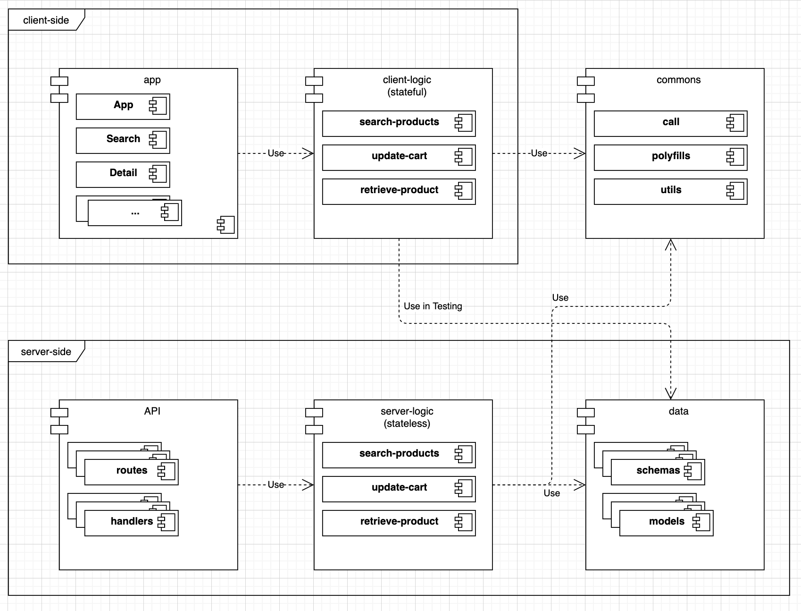
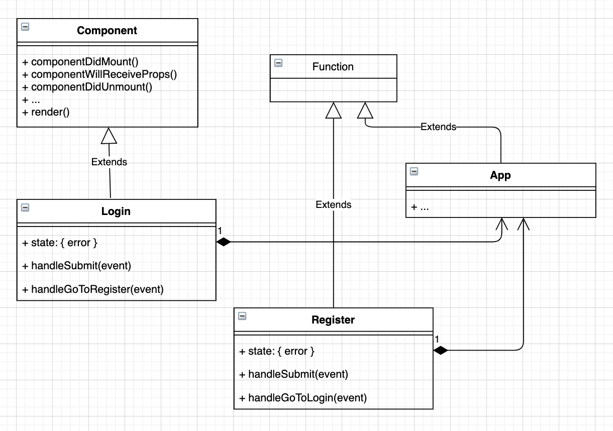
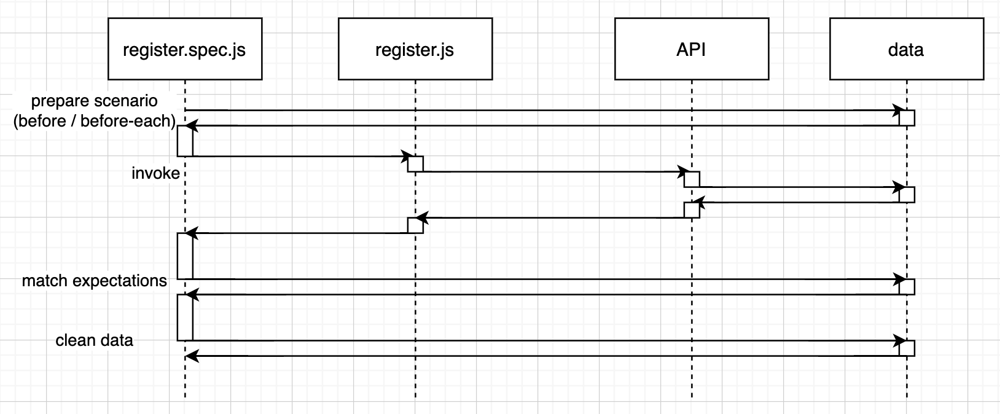
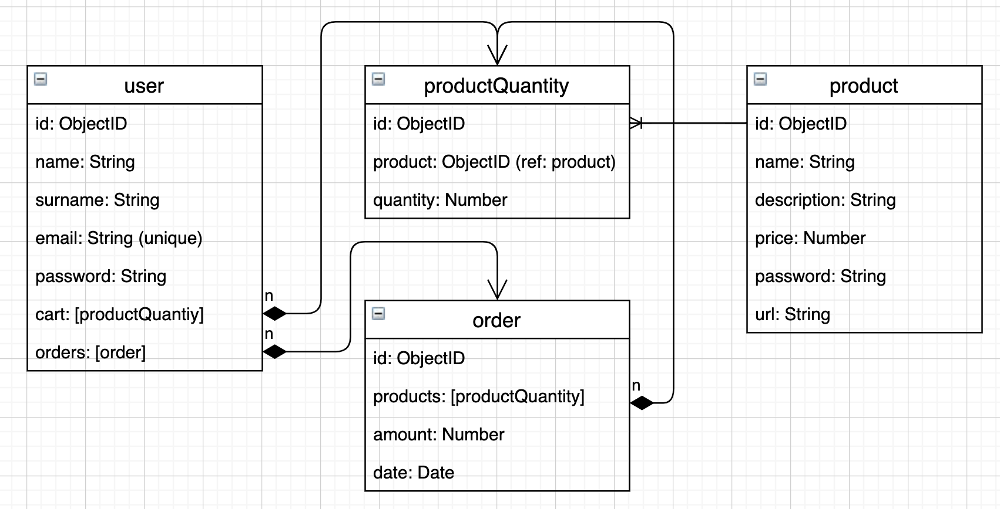
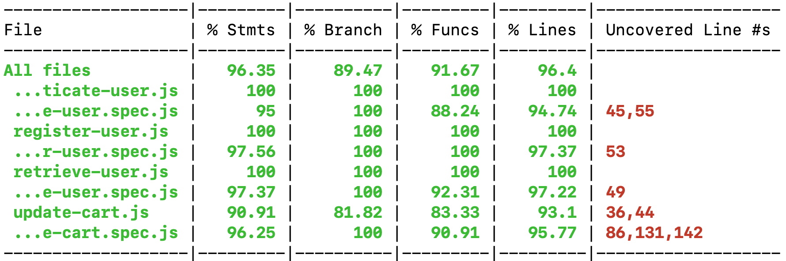

# Misc

TODO write introduction / description...

TODO funny animated gif


## Functional Description

TODO explain a bit (optional)

### Use Cases



### Activities

Search products and add to cart



...

## Technical Description

TODO explain a bit (optional)

## Blocks

TODO explanation (optional)



## Modules / Components



## Classes



## Sequences

Testing



...

TODO other sequences like search, detail, login, register

## Data Model



## Code Coverage

Client-side


Server-side



## Instructions

### Server-side

TODO explain how to test and run the API (the commands etc)

#### Testing

Go to module `misc-server-logic`

```sh
$ npm test
```

#####  Code Coverage

```sh
$ npm run test:coverage
```

### Run

Go to module `misc-api`

```sh
$ npm start
```

#### Watching (development only)

```sh
$ npm run watch
```

### Client-side

TODO explain how to test and run the App (the commands etc)

#### Testing

Go to module `misc-client-logic`

```sh
$ npm test
```

#####  Code Coverage

```sh
$ npm run test:coverage
```

### Run

Go to module `misc-app`

```sh
$ npm start
```

#### Enter

```sh
$ open http://localhost:3000/
```

### Template

Go to module `misc-template`

```sh
$ npm run style
```