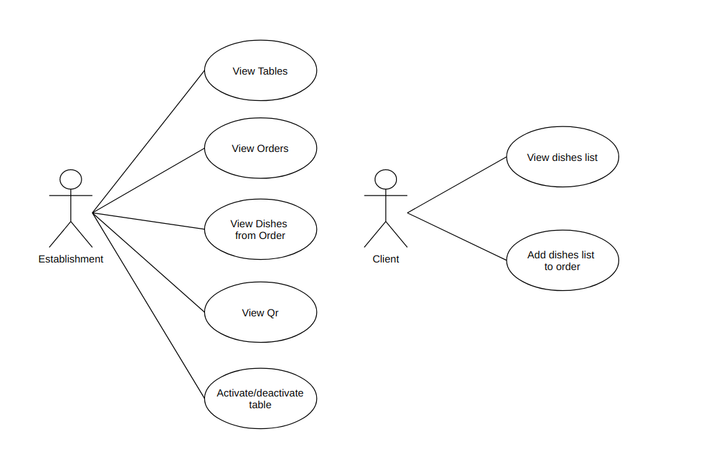
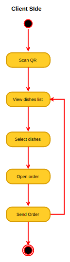
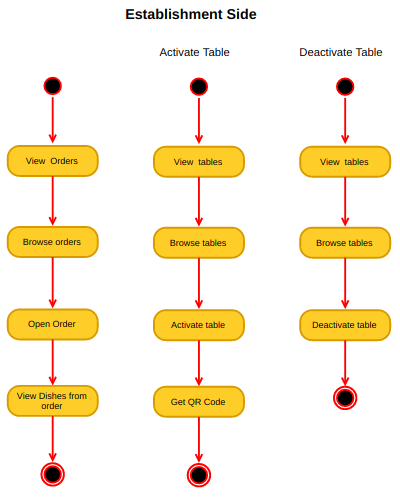
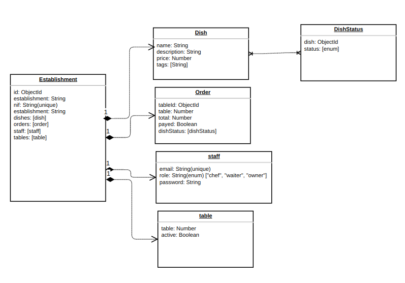
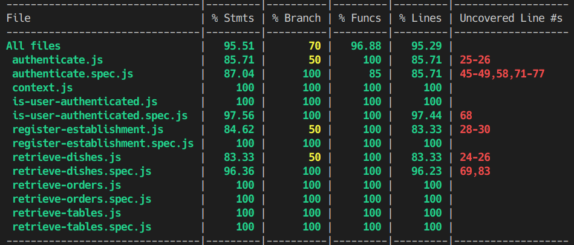
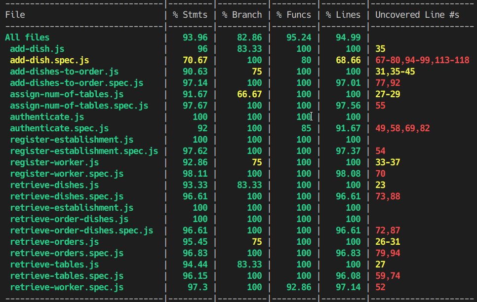

# QR Menu

The app is made for catering establishments.
It is divided into two parts, the establishment part, and the client part of the establishment.
The waiter has a list of the tables that the establishment has, as soon as he activates it, a QR code appears which the client will have to scan.
Once the QR code is scanned, the client is redirected to the menu of dishes that this establishment has, at that moment select the dishes they want and send the request knowing the total price of the dishes.
At the time the request is sent, in the kitchen they will have a new order, when they open it they will see the dishes they have to cook for that table.
At the end of the service, the waiter closes the table so that orders cannot continue to arrive

TODO funny animated gif

## Functional Description

You can retrieve tables from the establishment, switch on and off table activity, retrieve a QR code to redirect to a dishes list 
from the establishment, view orders from the clients and open it to view the dishes to cook.

### Use Cases

### Activities

Search products and add to cart

...

## Blocks

## Modules / Components

## Data Model

## Code Coverage

Client-side

Server-side

