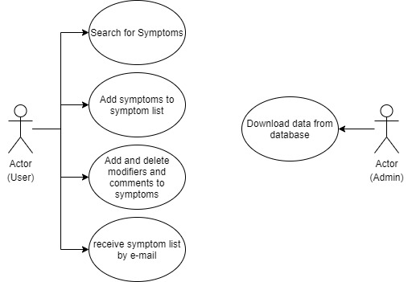
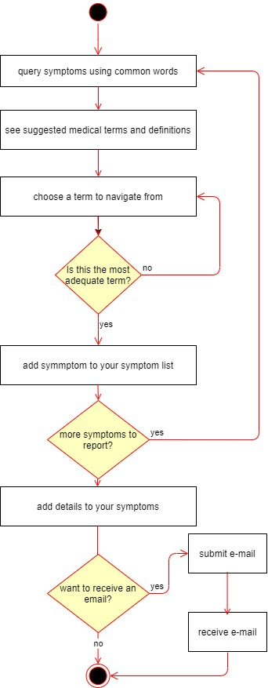
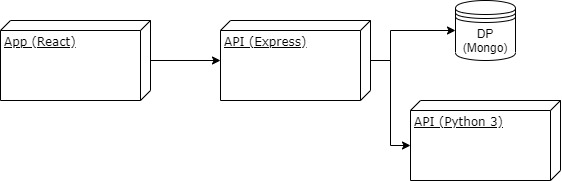
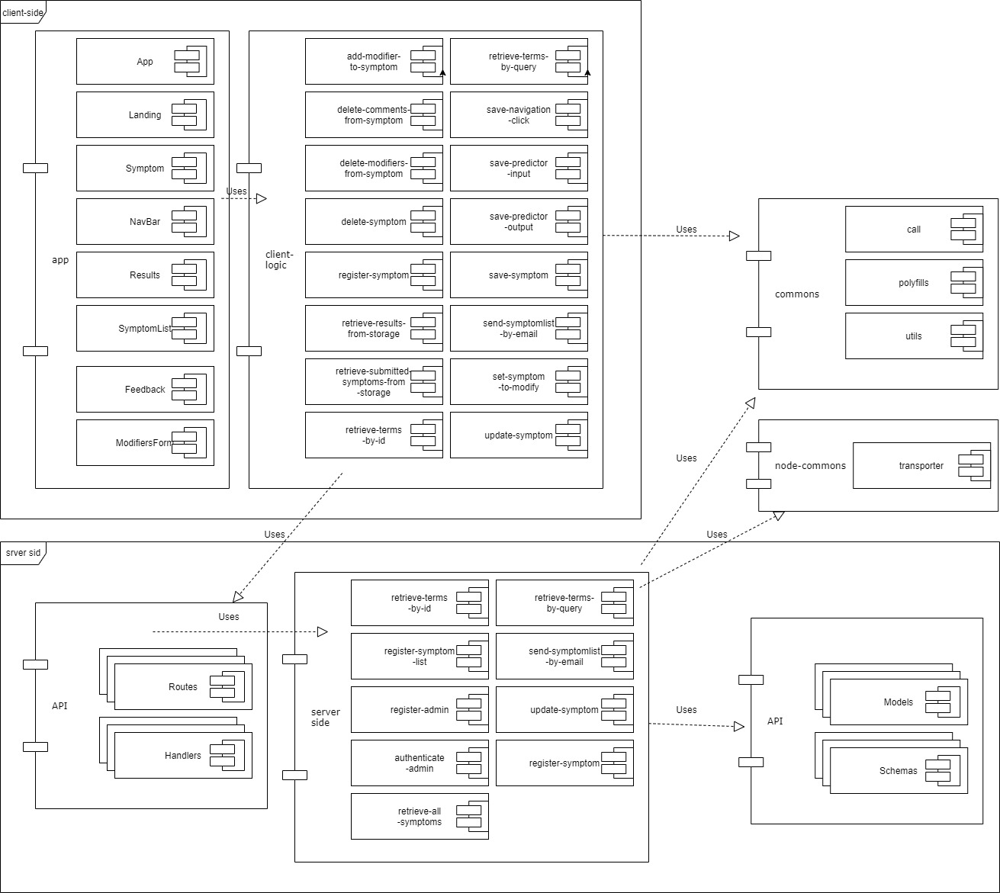
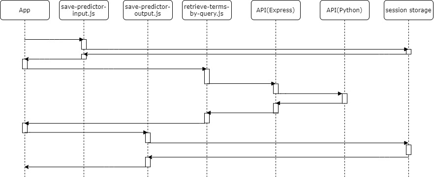
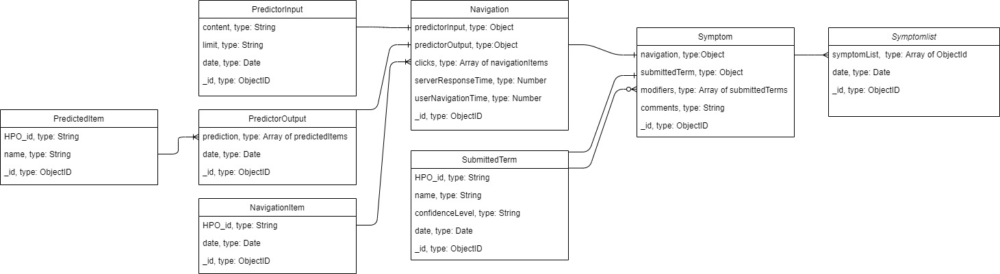

# Symptomiser

## Intro

An interactive visual tool to accurately describe symptoms, designed to facilitate symptom report by patients and doctors.

## Functional Description

Firstly, the app provides a query system that receives common words and returns suggestions of related medical terms. This query system was kindly provided by the B2SLab of the UPC (Alex Perera and Jon Garrido).

The user can then navigate through a series of related terms from the HPO database in order to find the term that describes the symptom as accurately as possible. 

Once the most accurate term is submitted the user can add a series of details such as position or severity, and add comments to the symptom. 

The user will be able to collect a list of symptoms and then receive that e-mail with their symptom list.

The data from the user navigation, submitted symptoms and the symptom lists are collected anonymously in order to evaluate the usage of the app and its performance.

### Apis

### Use Cases

### Activity Diagram

### Blocks

### Components

### Query sequence

### Data Model

### Code Coverage

