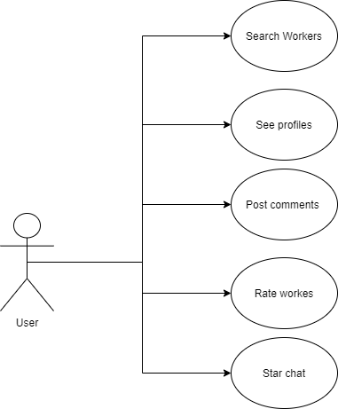
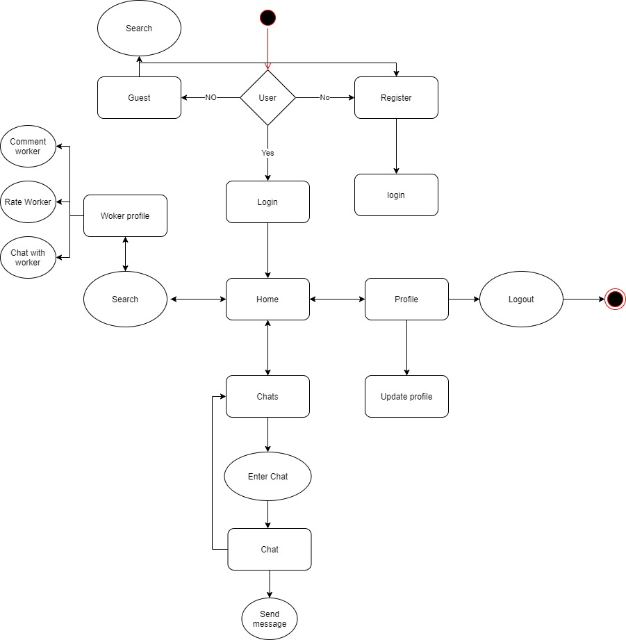
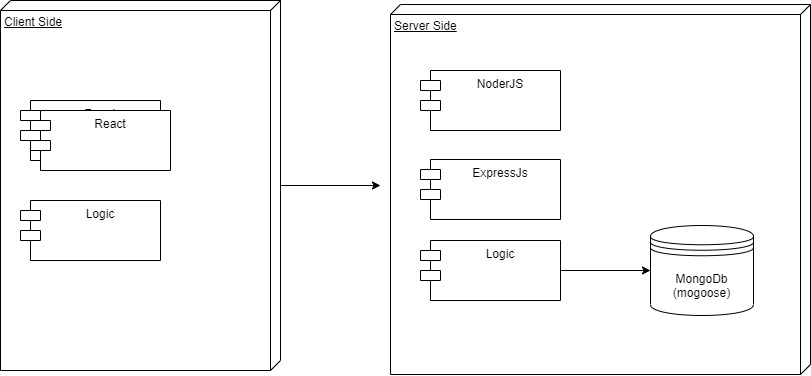
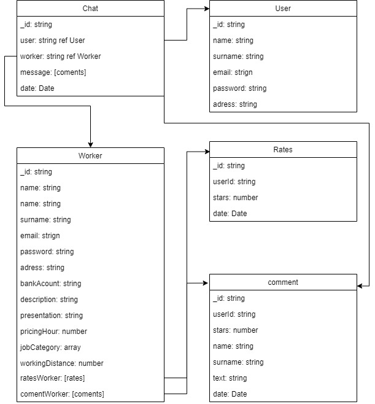
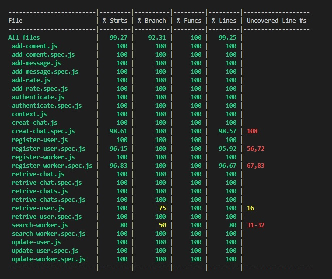

# TakeMyTask

## Introduction

TakeMyTask is an app thought to help with your tasks at home that you dont want to do, you dont have the time or the skills needed.

The users of this app will be able to work with us and creat a worker acount, or use it to contract people anouce in the app. 
Workers will be able to make their profile and will and will be rated to give a feedback to new people that want to contract them. All the talkin can be done in the app via chat 

## Functional Description

* The app can be used by users register and not registerd
* Users unregister will be only able to se the list of workers and the landig page
* Registerd users can see the wokers profiles, start a chat with the workers put comments in thei profile and rate the workers
* The search can be done by name or job category

## Use Cases

## Flow 

## Blocks

## Data Model

## Api code coverage

## client code coverage

