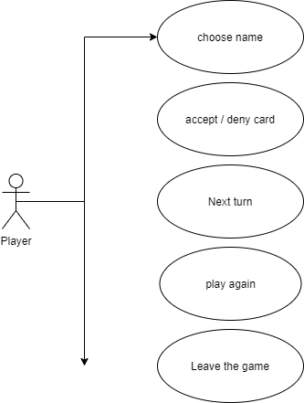

# Bingo

The bingo is a game in which prizes can be won by matching numbers on a card with those chosen by chance.

## Functional Description

- First, a card with random numbers is created for you. If you want to play with that card of numbers you can click on "Continue".
- After continuing, a new single random is created and compared to the numbers form your card, if on of the numbers is matched, an "X" will be replaced to the number matched. 
- This process will last untill the end of the game, where all the numbers from the card become "X's".

