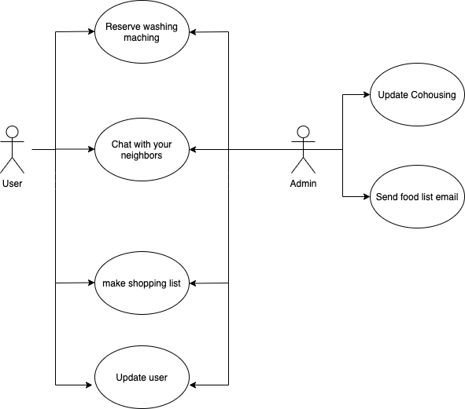
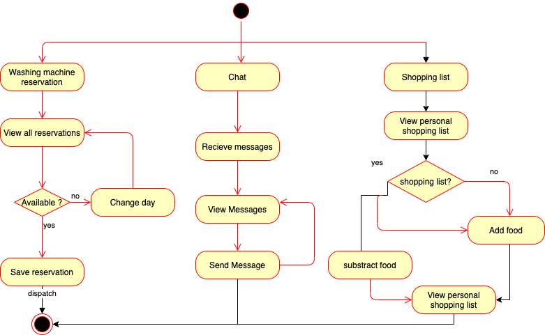
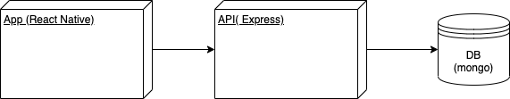
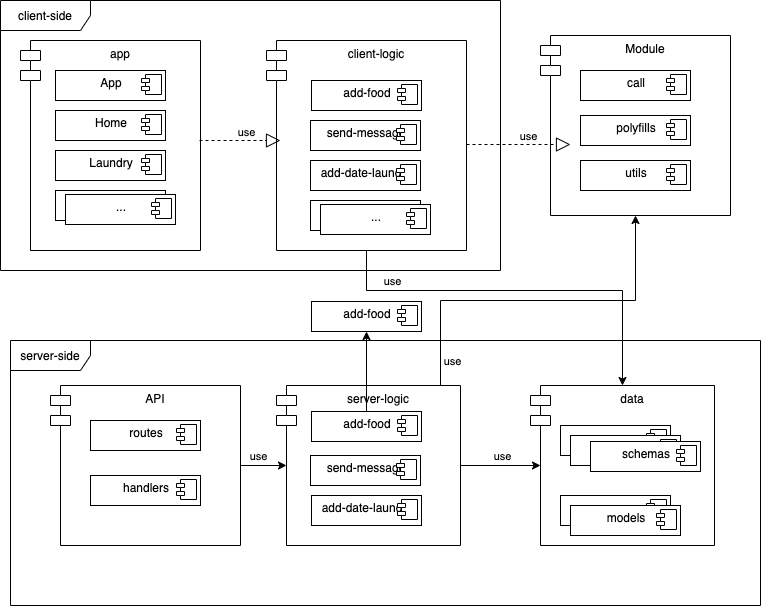
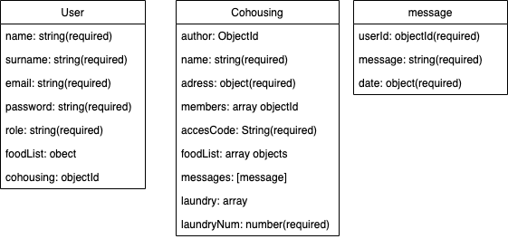
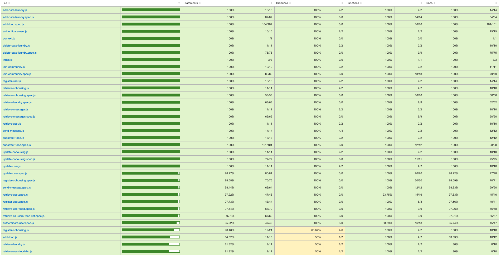
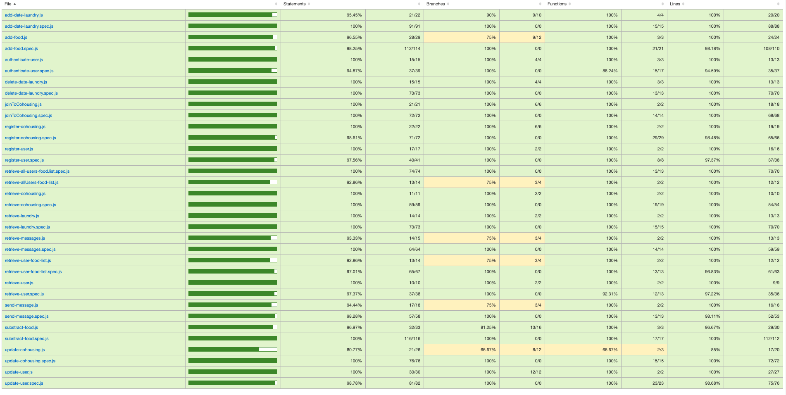

# CooHappy

Your app to organize your cohousing

Cohappy is born to make co-housing easier. I got the idea while taking part of “cohousing Barcelona”, a cooperative developed for hosting, and notice the big need for a mobile app in this sector, as there is still so little. So, with not much more to say, I putted together an alternative of app solution for this market not yet explored.

## Functional Description

* Chat with your neighbors 
* Organize your laundry to avoid running out of washing machine
* Make the weekly shopping list, unifying all the demands of the neighbors, thus facilitating orders to the supplier

### Use Cases

### Activities

Chat, reservation laundry and shop list

## Blocks

## Modules / Components

## Data Model

## Code Coverage

Client-side

Server-side

