# BOOKS

This application allows you to recycle your books just by sharing them! We live in a great community of readers and books need to travel and share their knowledge! So there is nothing better than searching and seeing the quantities of books around you, ready to be ordered and shared.


## Functional Description

This application allows:

- add books to your library, by search engine or by reading barcode.
- search for users and view their profiles.
- search for books in the library of books ready to share.
- borrow the books.
- send messages to the user to request a book.
- list the received messages.
- bookmark users.
- give a star rating to users.

## Use Cases

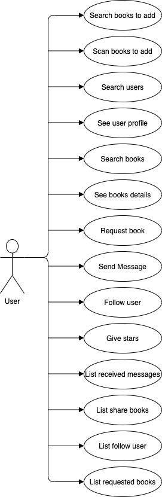

## Activities

#### Add Books to your library
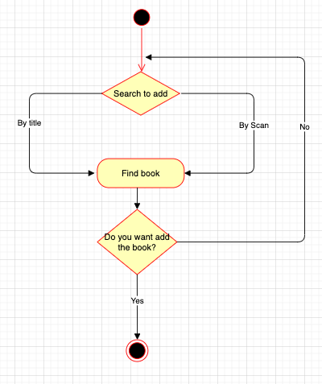
#### Search books

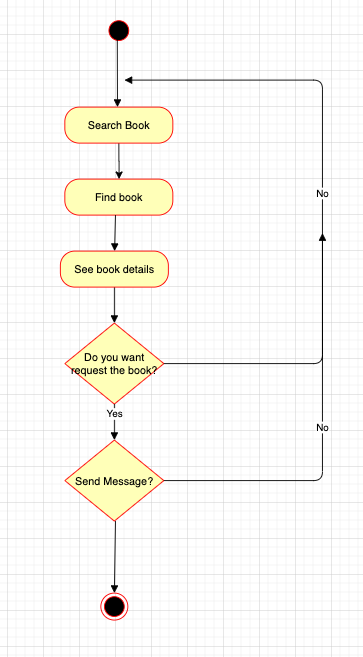
#### Search users

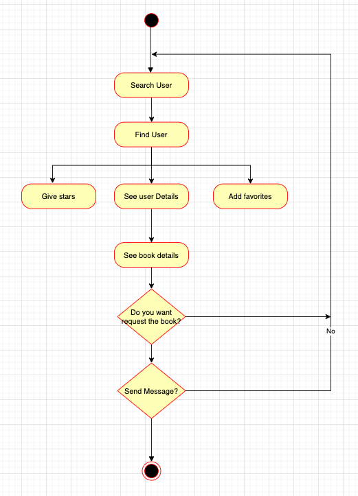
#### List messages

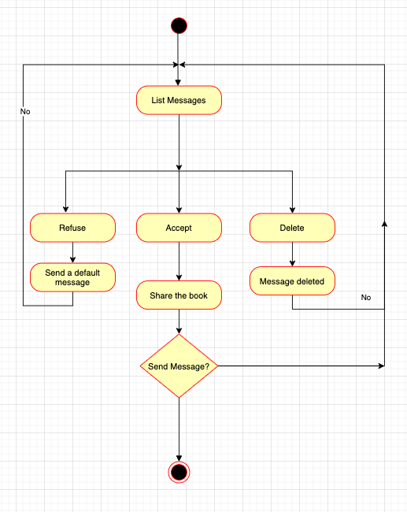
#### List favorites

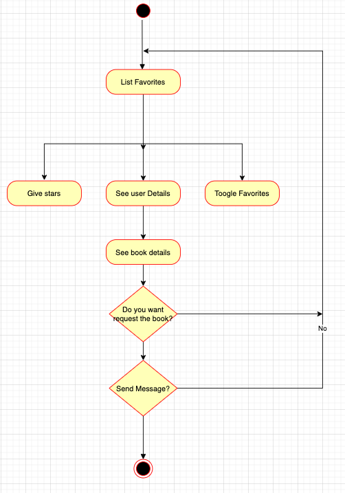

## Blocks

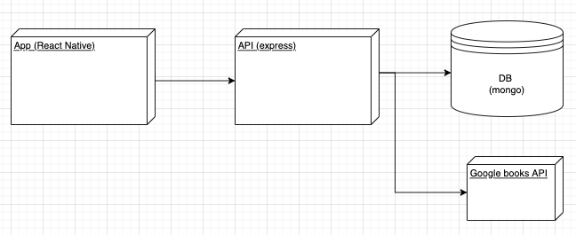

## Modules / Components

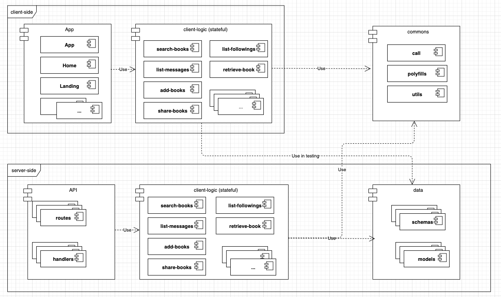

## Classes


## Data Model

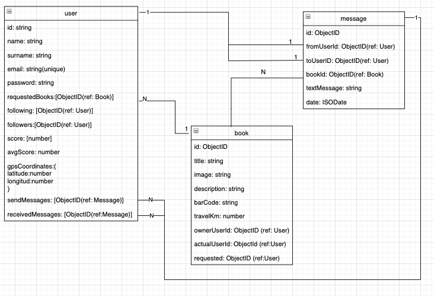

## Code Coverage

Client-side

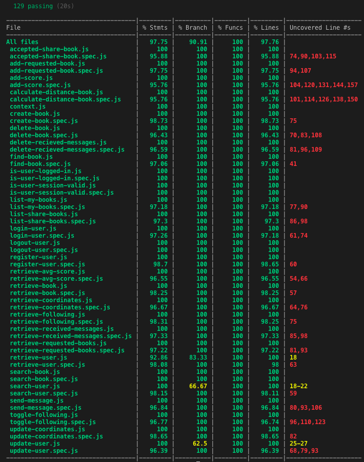

Server-side

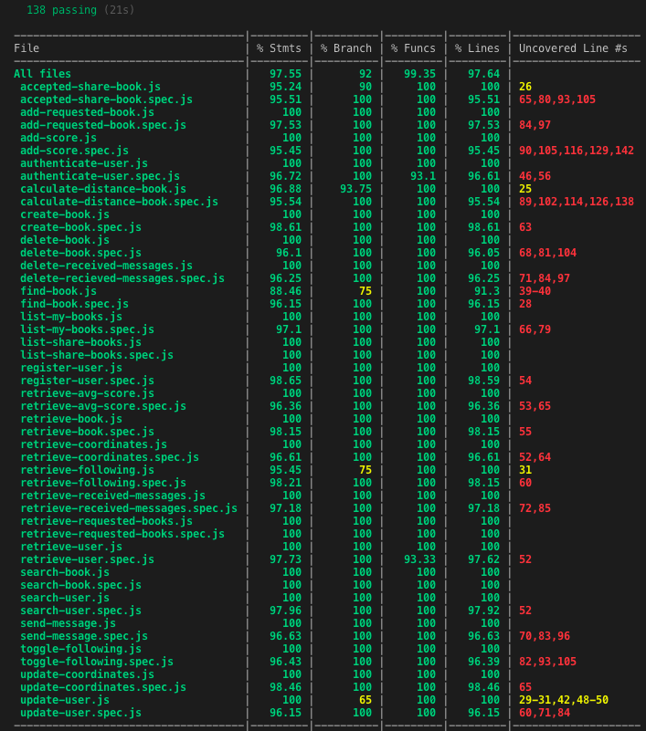

## Instructions

### Server-side

#### Testing

Go to module `books-server-logic`

```sh
$ npm test
```

#####  Code Coverage

```sh
$ npm run test:coverage
```

### Run

Go to module `books-api`

```sh
$ npm start
```

#### Watching (development only)

```sh
$ npm run watch
```

### Client-side

#### Testing

Go to module `books-client-logic`

```sh
$ npm test
```

#####  Code Coverage

```sh
$ npm run test:coverage
```

### Run

Go to module `books-app`

```sh
$ npm start
```

#### Enter

```sh
$ open http://localhost:8080/
```
