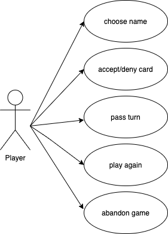
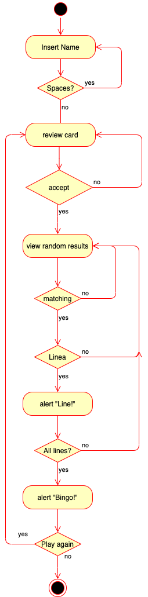

# BINGO
 
 A game of chance in a player has one card printed with differently numbered squares on which to place markers when the respective numbers are drawn and announced by a caller. The first player to mark a complete row or other pattern of numbers is the winner.
 
 

## Functional Description
- Creat a bingo card with 15 diferents numbers.
- Chose if you want generate another card.
- To the next turn the user must confirm to display another number.
- If it matches any of the existing ones on the card, it will change to one " X ".
- When all the numbers on the same line are "X", it will show a message "LINE!".
- The game will only end when all the numbers are at "X".
- User Ranking.
- Ask if you want to play again.

## Use Cases

## Work Flow
