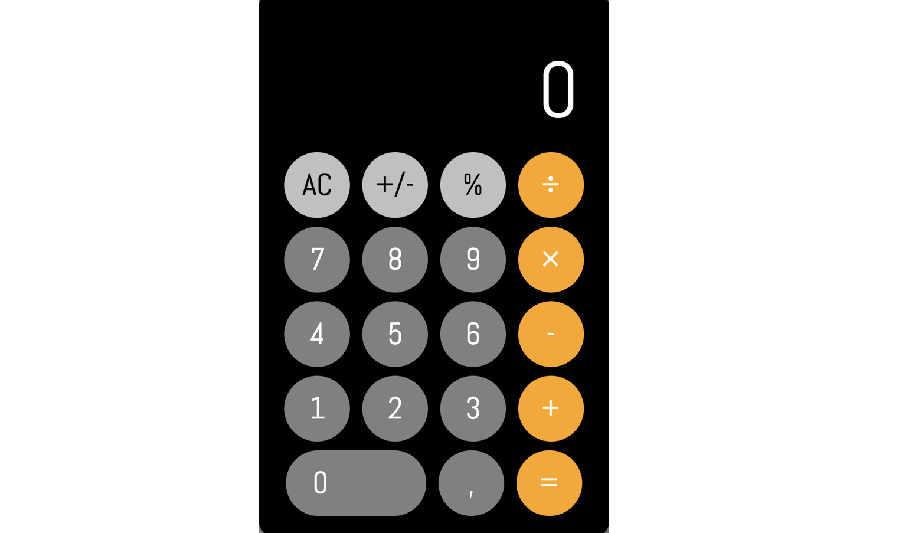

# Calculator

Basic calculator

 

## Functional Description

- You can calculate addition, subtraction, multiplication and division.
- The result should be displayed with 3 decimal places at most (in case there are).

## Image

